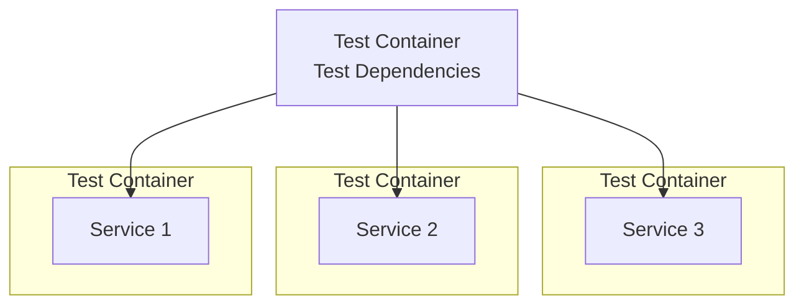

After finally updating my blog to be a standalone site, I decided to start writing more about the different concepts I learn and the projects I build along the way, in order to form a more concrete **note-making system**[^1]. A while back, I had set up a GitHub Action to scrape both [dev.to](https://dev.to/) and [medium.com](https://medium.com/), the platforms where I previously hosted the few articles I had written back in the day.

However, after setting up my blog with the cool [hugo-narrow](https://github.com/tom2almighty/hugo-narrow) theme and enabling the RSS feed, it was finally time to migrate from that action to a custom one. This new action objective is to fetch my personal RSS feed and periodically updates the README.md on
my GitHub profile with the five most recent articles. Here is to hoping I write a lot more by the end of the year 😁!

I chose to use [Dagger](https://dagger.io) to automate this process. Dagger, created by the team behind Docker, solves a huge pain point in the CI ecosystem: the overwhelming amount of YAML slop required to run a workflow.
What I found cool about Dagger is that, similar to how Infrastructure as Code (IaC) works, we can write our CI as code. This gives us a lot of versatility in crafting our software workflows. For example, we can build a
test container with the libraries and dependencies we need, and reuse it to run different sets of tests for multiple services.



If we ever need to migrate our pipeline to another platform, we can simply move our code to that platform using Git and bam! run it the same way. Once we have our action, we can reuse[^2] it, since modules are just source code.

## Coding up the RSS Scrapper

OK, let's get started with our RSS feed automation. For this project, I'll be using [Dagger's Go SDK](https://github.com/dagger/dagger/tree/main/sdk/go).
First, I'll create a simple HTTP client to get the RSS feed from my blog. We'll store the result in a custom RSS struct with all the important fields.

```go
func fetchFeed(url string) (RSSFeed, error) {
	httpclient := http.Client{Timeout: 10 * time.Second}

	rssFeed := RSSFeed{}
	res, err := httpclient.Get(url)
	if err != nil {
		return rssFeed, err
	}
	defer res.Body.Close()

	data, err := io.ReadAll(res.Body)
	if err != nil {
		return rssFeed, err
	}

	err = xml.Unmarshal(data, &rssFeed)
	if err != nil {
		return rssFeed, err
	}

	return rssFeed, err
}
```

## Automating README Writing

It’s time to daggerize our workflow. We have a few steps to complete in order to achieve full automation:

1. [ ] Format the RSS Feed content for the new README
2. [ ] Mount our repository into a container
3. [ ] Add our README file to the repository
4. [ ] Run Git commands to upload changes
5. [ ] Setup the Github Action

Our initial Dagger function signature will look like this.

```go
func (m *K1nho) UpdateReadme(
	// +defaultPath="."
	source *dagger.Directory,
	token *dagger.Secret,

){}
```

We will get to what the `source` and `token` arguments are for in just a bit, but first let us prepare the content.

## Formatting the RSS Feed content

To update the **README.md**, we need to modify its current content and add the articles fetched by our RSS feed scraper. We’ll use a helper function to prepare the string to be written.

```go
func formatBlogList(items []RSSItem, max int) string {
	var sb strings.Builder
	count := 0
	for _, item := range items {
		if count >= max {
			break
		}
		sb.WriteString(fmt.Sprintf("- [%s](%s)\n", item.Title, item.Link))
		count++
	}
	return sb.String()
}
```

This function takes our list of items, and for each one, creates a line with the title of the article and a link to it. We also include a `max` argument in case we want to display more or fewer articles.
With that in place, we can add the new string to the existing README content. First, we use the source parameter we passed to our function to get the current content of the README.md from the repository.

```go
file := source.Directory(".").File("README.md")
readmeContent, err := file.Contents(context.Background())
	if err != nil {
		log.Fatal(err)
	}
```

The key part here is that we set the `defaultPath` of `source` to be the current directory, which is the root of the repository. Then we specify that we want the README.md file, and we get its content using the `Contents()` method. Now we can substitute the blog list in.

```go
start, end := "<!-- BLOG-POST-LIST:START -->", "<!-- BLOG-POST-LIST:END -->"
	startIdx := strings.Index(readmeContent, start)
	endIdx := strings.Index(readmeContent, end)
	if startIdx == -1 || endIdx == -1 || startIdx > endIdx {
		log.Fatal("could not retrieve the start/end of the blog list")
	}

	newContent := readmeContent[:startIdx+len(start)] + "\n" + blogListString + readmeContent[endIdx:]
```

In this case, I have added the comments `<!-- BLOG-POST-LIST:START -->` and `<!-- BLOG-POST-LIST:END -->` to mark the section where the RSS feed will be inserted. We're done with the content!

1. [x] Format the RSS Feed content for the new README
2. [ ] Mount our repository into a container
3. [ ] Add our README file to the repository
4. [ ] Run Git commands to upload changes
5. [ ] Setup the Github Action

## Container Time!

Now it’s time to create our container to automate the process. Similar to writing a Dockerfile, we think in layers, starting from our base image and then adding the README.md file with the new content.

In Dagger, we have a special type for [secrets](https://docs.dagger.io/getting-started/types/secret/), which we use for our token parameter. This will receive the **GITHUB_TOKEN** when running our action.

```go {hl_lines=[4]}
ctr := dag.Container().From("alpine/git").
		WithDirectory("/k1nho", source.WithNewFile("README.md", newContent)).
		WithWorkdir("/k1nho").
		WithSecretVariable("GITHUB_TOKEN", token) // token *dagger.Secret
```

1. [x] Format the RSS Feed content for the new README
2. [x] Mount our repository into a container
3. [x] Add our README file to the repository
4. [ ] Run Git commands to upload changes
5. [ ] Setup the Github Action

## Pushing Update with Git

Let’s finalize the workflow by setting up the Git operations.

```go {lineNos=true hl_lines=[8, 11]}
ctr := dag.Container().From("alpine/git").
        WithDirectory("/k1nho", source.WithNewFile("README.md", newContent)).
		WithWorkdir("/k1nho").
		WithSecretVariable("GITHUB_TOKEN", token).
    	WithExec([]string{"git", "config", "--global", "user.name", "k1nho"}).
		WithExec([]string{"git", "config", "--global", "user.email", "kinhong99@gmail.com"}).
		WithExec([]string{"git", "add", "README.md"}).
		WithExec([]string{"sh", "-c", "git diff --cached --quiet || git commit -m 'cron: update blog posts in README'"}).
        WithExec([]string{"git", "push", "origin", "HEAD"})

	_, err = ctr.ExitCode(context.Background()) // execute container
	if err != nil {
		log.Fatal("git push failed: %v", err)
	}
```

In line 8, we check if there is a diff compared to the previous README.md. If there is, we commit the change. Lastly, we call the `ExitCode()` method. This step is crucial because, up until the last Git instruction,
we have been doing deferred evaluation, so in order to execute the pipeline we need to call `ExitCode()` to run all the operations. Alternatively, `Stdout()` can also be used.

1. [x] Format the RSS Feed content for the new README
2. [x] Mount our repository into a container
3. [x] Add our README file to the repository
4. [x] Run Git commands to upload changes
5. [ ] Setup the Github Action

## Automation Complete

All that's left is to set up our Dagger call in a GitHub Action. The YAML is very minimal, and more importantly, we now have a reusable module to update our `README.md` across any other Git hosting platform.

```yaml {filename=".github/workflows/rss_scrapper.yml"}
name: Update README with Blog Posts

on:
  schedule:
    - cron: "0 12 * * *"
  workflow_dispatch:

permissions:
  contents: write

jobs:
  update-readme:
    runs-on: ubuntu-latest
    steps:
      - name: Checkout Repo
        uses: actions/checkout@v5
      - uses: dagger/dagger-for-github@8.0.0

      - name: Fetch RSS feeds and Update README file
        env:
          GITHUB_TOKEN: ${{ secrets.GITHUB_TOKEN }}
        run: dagger call update-readme --token=env:GITHUB_TOKEN
```

1. [x] Format the RSS Feed content for the new README
2. [x] Mount our repository into a container
3. [x] Add our README file to the repository
4. [x] Run Git commands to upload changes
5. [x] Setup the Github Action

Full code: [here](https://github.com/k1nho/k1nho/blob/main/.dagger/main.go)

## Resources

- [Dagger](https://dagger.io/)

[^1]: [Note Making](https://libguides.cam.ac.uk/wolfsoncollege/notemaking)
[^2]: [Dagger Reusability](https://docs.dagger.io/features/reusability/)
