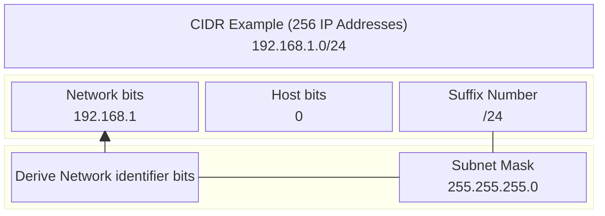
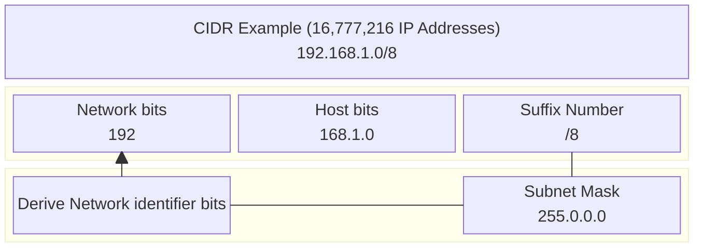

If you are perusing through some DevOps articles or documentation, chances are you might have encountered the acronym **CIDR**, but what the heck is it? and why is it a fundamental concept in modern-day networking?

## We had ABCs

An IP address consists of a **network portion** and a **host portion**. Before CIDR existed, IP address allocation was based on a classful system[^1] such as **Class A (8 network prefix bits)**, **Class B (16 network prefix bits)**, and **Class C (24 network prefix bits)**.

The fixed nature of the classful system led to ==IP address waste==. For example, for a network with 500 devices, a Class C IP address would only cover up to 256 (2^8), which meant that an upgrade to Class B would be the next move.
However, this led to the waste of 65,036 IP addresses, as only 500 were needed. Wouldn’t it be nice in this case to provision fewer IP addresses to reduce the waste?

## Classless Inter Domain Routing (CIDR)

Enter the ==Classless Inter Domain Routing==, or CIDR for short. The CIDR represents a contiguous block of IP addresses, and has the format of an IP Address followed by a suffix number.

[^1]: [Classful IP Addressing](https://www.geeksforgeeks.org/computer-networks/introduction-of-classful-ip-addressing/)

## CIDR Examples

Let's take a look at some examples, with the following CIDR block.

The key here is the suffix number, which corresponds to the **prefix length of the network portion of the address** aka the **subnet mask**. Therefore, to return the value of the network address, we apply the subnet mask by turning the host address bits into zeroes.
In the above example, we have **24 bits for the network identifier**, and the remaining **8 bits for the host identifier** which results in **256 total IP addresses**. If we wanted to have more IP addresses, we would decrement the suffix number.

In contrast, if we define **8 bits for the network portion of the address**, we have **24 bits that are variable for host addresses**, resulting in (2^24) or **16,777,216** available IPs, that's a lot! Similarly, if we wanted less we just have to adjust the notation of
the CIDR suffix to be larger.

Now let's try, for CIDR **192.168.1.0/16** can you find the correct values for the **network bits, host bits**, **the total number of IPs** and, **the subnet mask**?

Solution

We start with the suffix number which in this case is **/16** that already tells us the network bits.

- **Network bits: 16**

We can then work our way to the host bits, in this case we are in IPv4, so
we have (32-16) = 16 host bits.

- **Host bits: 16**

By determining the host bits, we can then get the total IP's

- **Total IPs: (2^16) = 65,536**

Lastly, the subnet mask results from turning the host bits into zeroes, that gives us:

- **255.255.0.0**

Now a small follow up, can you guess how many **/24** subnets do we have for our **/16** subnet ?

For **/16** we had **65,536** IPs if we divide by the total IPs we get from **/24** which is **256**, we get:

- **65,536/256 = 256**

So, we can have **256 /24** segments from our **/16** subnet.

These calculations are what got me curious about CIDR. As I was setting up the CNI from scratch for my [Kubernetes Homelab](), it was natural to stumble upon the **Pod CIDR block**.
The CNI's default CIDR block was **10.0.0.0/8** whereas the k3s CIDR block was **10.42.0.0/16**. You can already see why a misconfiguration of the Pod CIDR block will cause all sorts of networking issues for pod-to-pod connectivity.
In Kubernetes, each node in the cluster gets assigned a **Pod CIDR**, from which an **individual pod on that node gets its own IP address**. Similarly, a **Service CIDR** across the cluster is used to assign internal IPs to services, enabling pods to discover and communicate with each other.

Thanks to CIDR, IP address allocation is efficient, reducing routing table size which allows routers to forward packets more effectively. Its use extends into the cloud native ecosystem with projects like Kubernetes relying on CIDR to allocate IP addresses for internal networking.

**Did you know about CIDR?**

## Resources

- [CIDR Calculator](https://www.ipaddressguide.com/cidr)
- [What is CIDR](https://aws.amazon.com/what-is/cidr/)
