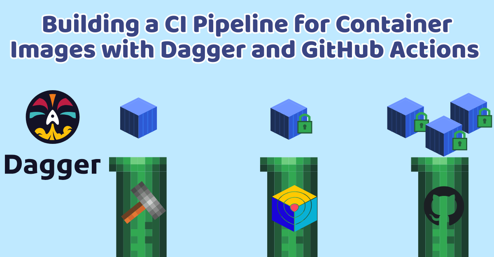

Recently, I've been hacking away in my [homelab](https://kincodes.com/tags/homelab-series/), and when it came time to deploy my blog, one thing became essential: **having a reliable pipeline for building, scanning, and publishing container images**.
Whether you're developing custom applications from scratch or creating hardened versions of existing images to strengthen their security posture, you need a robust build process you can trust.

While there are plenty of [GitHub Actions in the marketplace](https://github.com/marketplace?query=build+and+push+docker+image&type=actions) that can handle this, there's something uniquely powerful about owning a custom pipeline where you control every piece without drowning in YAML hell abstraction. Even better, what if you could **define your entire pipeline in code and test it locally**? Enter [Dagger](https://dagger.io/). With Dagger, your local pipeline runs are identical to what executes in CI, giving you fast feedback loops to iterate on the CI without waiting for runners.

In this guide, I'll walk through setting up a complete pipeline that **builds a container image, scans it for security vulnerabilities, and publishes it to a registry of your choice**, all using Go!



## The Stage

I wanted to have a container image for my blog that will be deployed on my tailnet via Argo CD. The app here is a simple static Hugo blog running on an nginx base.

To create a container image for our Kubernetes deployment, we need to have a pipeline. Normally, this pipeline can be as many steps
as you deemed necessary. However, usually there are 3 fundamental steps that are essential when creating a CI/CD pipeline: **build, security scanning, and publish**.
Let's explore how we can create these steps using the Dagger Go SDK.

## Daggerizing the Pipeline


### Initializing Dagger Module

Let's start by initializing our dagger module this is where our CI code will live.

```bash
dagger init --sdk=go --name=blog-ci
```

The following will create the `.dagger` directory with some boiler plate, I choose [Go](https://go.dev/) for the sdk, but feel free
to choose any language from their [available sdks](https://docs.dagger.io/getting-started/api/sdk/).

### Build CI

Let's start with the build step. Here, we generally want to specify the source of our project, the platform that we are building our container image for, and
the tags we want to apply.

```go
type ImageTags struct {
	// The Semantic Version, i.e, v1.0.0
	Version string `json:"version"`
	// The SHA digest
	SHA string `json:"sha"`
}
```

```go {filename=".dagger/main.go"}
// Build container from Dockerfile
func (m *BlogCi) BuildFromDockerfile(
	// +defaultPath="/"
	source *dagger.Directory,
	platform dagger.Platform,
	tags ImageTags,
	// +default="http://localhost:8080/"
	base_url string,
) *dagger.Container {

	return source.DockerBuild(dagger.DirectoryDockerBuildOpts{
		Platform: platform,
		BuildArgs: []dagger.BuildArg{
			dagger.BuildArg{Name: "BASE_URL", Value: base_url},
			dagger.BuildArg{Name: "GIT_SHA", Value: tags.SHA},
			dagger.BuildArg{Name: "VERSION", Value: tags.Version},
		},
	}).WithLabel("org.opencontainers.image.created", time.Now().UTC().Format(time.RFC3339))
}
```

We define the `BuildFromDockerfile` that takes some parameters:

- `source`: the directory where the Dockerfile is located
- `platform`: the specific platform variant, i.e, linux/amd64
- `tags`: A struct that contains both semantic version and github sha
- `base_url`: Hugo specific config for the base url of the website

Note that I pass in the build arguments slice to our container such that we apply appropriate metadata labels. At the end, the `BuildFromDockerfile` function will return a dagger container correctly tagged and ready to be published to a container registry.

> [!NOTE] Using Pure Dagger to Build the Image
> In this case, I use the native `DockerBuild` function to build the container from an existing Dockerfile. You can also define entirely in code
> the exact same container starting from `dag.Container().From("base-image")` and applying the layers that way. Check the example, in the [Dagger quickstart guide](http://docs.dagger.io/getting-started/quickstarts/ci)

### Security Scanning with Trivy


Now that we have a way to return our container image, we want to make sure that it does not contain any critical or high vulnerabilities. This step is often overlooked,
but in this modern era of **AI-generated code**, and with [big players in image hardening going closed source](https://thenewstack.io/broadcom-ends-free-bitnami-images-forcing-users-to-find-alternatives/),
we certainly want to be more conscious of having a **security first posture**.

We'll use [trivy](https://trivy.dev/), a fantastic security scanner to find CVEs and misconfigurations in our container image. In the case we detect a critical or high
vunerability in our image, we will halt the pipeline by returning an error.

```go
// Scan Image Built for Vulnerabilities
func (m *BlogCi) ScanVulnerabilities(ctx context.Context, ctr *dagger.Container) error {

	tarball := ctr.AsTarball()

	trivy := dag.Container().From("aquasec/trivy:0.68.2").
		WithMountedFile("/image.tar", tarball).
		WithExec([]string{
			"trivy",
			"image",
			"--input", "/image.tar",
			"--severity", "CRITICAL,HIGH",
			"--exit-code", "1", // signal critical/high vunerability found
			"--format", "table",
		})

	output, err := trivy.Stdout(ctx)
	if err != nil {
		return fmt.Errorf("critical/high vunerabilities detected: %s", err.Error())
	}

	fmt.Printf("Trivy scan success - no critical or high vulnerabilities found\n%s", output)
	return nil
}

```

We take our container from the build step and create a tarball, which we then feed into the trivy CLI image to determine if we have **critical/high vulnerabilities**.
If we find a vulnerability, the trivy container will have exit code 1.

### Publish CI

Lastly, we can publish that container by providing the specified parameters.

```go {filename=".dagger/main.go", linenos=true, hl_lines=["38-42"]}
// Publish Docker image to registry
func (m *BlogCi) PublishImage(ctx context.Context,
	name string,
	// +default="latest"
	version string,
	sha string,
	// +default="ttl.sh"
	registry string,
	username string,
	password *dagger.Secret,
	// +optional
	base_url string,
	// +defaultPath="/"
	source *dagger.Directory,
) (string, error) {

	url := "http://localhost:8080/"
	if base_url != "" {
		url = base_url
	}

	platforms := []dagger.Platform{
		"linux/amd64",
		"linux/arm64",
	}
	platformVariants := make([]*dagger.Container, 0, len(platforms))
	for _, platform := range platforms {
		ctr := m.BuildFromDockerfile(source, platform, ImageTags{Version: version, SHA: sha}, url)
		if err := m.ScanVulnerabilities(ctx, ctr); err != nil {
			return "", err
		}
		platformVariants = append(platformVariants, ctr)
	}

	imageName := fmt.Sprintf("%s/%s/%s:%s", registry, username, name, version)
	ctr := dag.Container()

	if registry != "ttl.sh" {
		ctr = ctr.WithRegistryAuth(registry, username, password)
	} else {
		imageName = fmt.Sprintf("%s/%s-%.0f", registry, name, math.Floor(rand.Float64()*10000000))
	}

	return ctr.Publish(ctx, imageName, dagger.ContainerPublishOpts{PlatformVariants: platformVariants})
}
```

The logic from **lines 38-42** helps us test the pipeline locally by publishing the container image to [ttl.sh](https://ttl.sh/),
and if we provide a different registry such as **ghcr.io** or **dockerhub**, it will apply the registry auth. This allows us to have faster feedback loops of the CI
without having to go through the github runners.

### Finishing the pipeline with GitHub Actions

Lastly, we can wrap our dagger call and have a simple github action that will run when we publish a tag as follows:

````yaml {filename=".github/workflows/publish.yaml"}
name: Publish Blog Image

on:
  push:
    tags:
      - "**"
jobs:
  publish:
    runs-on: ubuntu-24.04
    permissions:
      contents: read
      packages: write
    env:
      NAME: kinho-blog
      USERNAME: ${{github.repository_owner}}
      SHA_TAG: ${{github.sha}}
      SEMVER_TAG: ${{github.ref_name}}
      BASE_URL: https://blog.manakin-koi.ts.net # image for tailnet

    steps:
      - name: Checkout repository
        uses: actions/checkout@v4
        with:
          submodules: true
          fetch-depth: 0
      - uses: dagger/dagger-for-github@8.0.0

      - name: Publish Blog Docker Image to ghcr
        env:
          PASSWORD: ${{ secrets.GITHUB_TOKEN }}
        run: |
          dagger call publish-image --registry=ghcr.io --name=$NAME --version=latest --sha=$SHA_TAG --base-url=$BASE_URL --username=$USERNAME --password=env:PASSWORD # latest
          dagger call publish-image --registry=ghcr.io --name=$NAME --version=$SEMVER_TAG --sha=$SHA_TAG --base-url=$BASE_URL --username=$USERNAME --password=env:PASSWORD # semver
          dagger call publish-image --registry=ghcr.io --name=$NAME --version=$SHA_TAG --sha=$SHA_TAG --base-url=$BASE_URL --username=$USERNAME --password=env:PASSWORD # sha```
````

The action will trigger our full Dagger pipeline every time I create a new tag. Now, with the pipeline set I can push new versions of my blog with a tag, and I can
use the generated container image in my kubernetes deployments, very cool!
