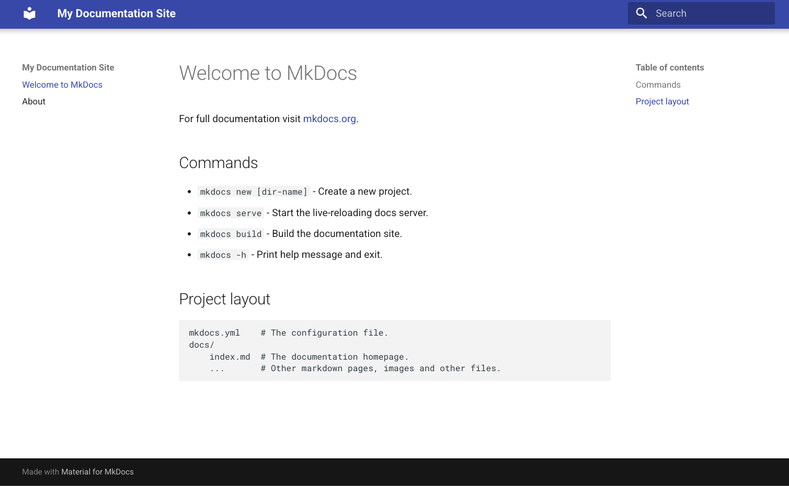
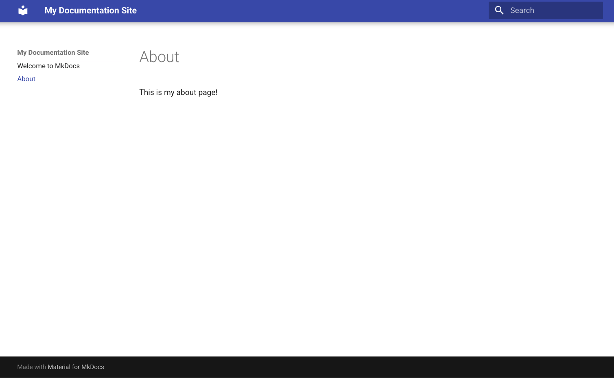

Documentation is one of the most important pieces in any software project. Without documentation, it becomes harder to onboard new developers or gather community feedback, since there is
no clear understanding of what the project is about or how to use it. On the other hand, documentation might exist, but it can sometimes be a nightmare to find the actual information due to a lack of search functionality, and aesthetically, it might just not be pleasing to look at.

Recently I was looking into creating a command-line interface in Python. In the past I've used Go's [Cobra](https://cobra.dev/) for developing CLIs, but for this project, most of the service code was in Python. Naturally, we wanted to keep the codebase tight, with no language fragmentation.
I stumbled upon [Typer](https://typer.tiangolo.com/) with a solid ecosystem over 18.000+ stars and active contributors so it seemed like the natural choice.

However, as I was learning more about Typer, something caught my eye: its **beautiful and extensive documentation**. It made getting started a breeze, and it turns out it was built with [Mkdocs Material](https://squidfunk.github.io/mkdocs-material/).

I actually had a need to create a few documentation sites for different projects at work. These projects already had software but were missing documentation.

Let’s walk through how to set up MkDocs Material and get a documentation site up and running.

## Mkdocs Material Installation

For this I will be using [uv](https://docs.astral.sh/uv/) as the package manager, but feel free to follow along with the default `venv`, `conda`, or anything else you like. Installing mkdocs is simple, we just run the following commands:

```bash
# create a virtual environment
uv venv --python=3.10
source .venv/bin/activate
```

```bash
uv pip install mkdocs-material
```

Great, now we are ready to use it to create our documentation. We will want to achieve the following in order to get a simple docs site up and running:

1. [ ] Documentation structure
2. [ ] Configuring site via mkdocs.yaml
3. [ ] Adding content
4. [ ] Deploy on github pages

## Setting Mkdocs Material Structure

The only two requirements we need to setup a valid Mkdocs material are:

- A `mkdocs.yaml` at the root of the project, which will configure our website
- A `docs/` folder, where our content files will go

Let’s run the following commands to get our project started:

```bash
mkdir my_doc_site
cd my_doc_site
```

```bash
# create the mkdocs structure
mkdocs new .
```

Awesome! we should now have the following structure:

```
my_doc_site/
|
|---docs/
|   |
|   ---index.md
|---mkdocs.yaml
```

1. [x] Documentation structure
2. [ ] Configuring site via mkdocs.yaml
3. [ ] Adding content
4. [ ] Deploy on github pages

## Configuring the Site

The file `mkdocs.yaml` will serve as the configuration file for our site. There is an extensive list of [fields](https://squidfunk.github.io/mkdocs-material/creating-your-site/#advanced-configuration) you can set, but for now, we can go with the minimal setup and enable material as the theme.

```yaml {filename="mkdocs.yaml"}
site_name: My Documentation Site
site_url: https://mydomain.org/mysite
theme:
  name: material
```

1. [x] Documentation structure
2. [x] Configuring site via mkdocs.yaml
3. [ ] Adding content
4. [ ] Deploy on github pages

## Adding Content

Earlier we mentioned that we use the `docs/` directory to place our content, so let's do that. Let's add an extra about page with the following command:

```bash
touch docs/about.md
```

```bash
echo 'This is my about page!' >> docs/about.md
```

Fantastic, we can now look at what we have by running:

```bash
mkdocs serve
```

If we check [localhost:8000](http://localhost:8000), we should now see our site with already a lot of structure baked in such as a navbar, search bar, navigation links, and a table of contents for the current page.



Let us visit the about page. We can then see the content that we have put in before.



1. [x] Documentation structure
2. [x] Configuring site via mkdocs.yaml
3. [x] Adding content
4. [ ] Deploy on github pages

## Deploy on Github Pages

Lastly, we want to make our documentation site accessible, so we can distribute and reference it in the future. Let us setup a github action that will automate the process for us whenever we modify our documentation and push to our main branch.

```yaml {filename=".github/workflows/deploy.yaml" lineNos=true hl_lines=[30]}
name: Deploy documentation page

on:
  push:
    paths:
      - "docs/**"
      - "mkdocs.yml"
    branches:
      - main

jobs:
  deploy:
    runs-on: ubuntu-latest

    steps:
      - name: Checkout repo
        uses: actions/checkout@v5

      - name: Set up Python
        uses: actions/setup-python@v5
        with:
          python-version: "3.10"

      - name: Install mkdocs
        run: |
          pip install mkdocs-material

      - name: Deploy to GitHub Pages
        run: |
          mkdocs gh-deploy --force # easy command to deploy into github_pages branch
        env:
          GH_TOKEN: ${{ secrets.GITHUB_TOKEN }}
```

> [!IMPORTANT]
> Setup the deployment under **Settings > Pages** to be done from gh-pages branch then click **Save**. 

1. [x] Documentation structure
2. [x] Configuring site via mkdocs.yaml
3. [x] Adding content
4. [x] Deploy on github pages

That it is! We have deployed our documentation using GitHub Pages and can now distribute it as needed. As an exercise you can check out the [Mkdocs Material Reference](https://squidfunk.github.io/mkdocs-material/reference/)
to add things like admonitions, tables, and more. Also, you can explore how to add custom routing or themes with palette support for light/dark modes.

## Resources

- [Mkdocs Material](https://squidfunk.github.io/mkdocs-material/)
- [Mkdocs Material Reference](https://squidfunk.github.io/mkdocs-material/reference/)
- [Mkdocs Material Advanced Configurations](https://squidfunk.github.io/mkdocs-material/creating-your-site/#advanced-configuration)
- Some inspiration sites [Typer](https://typer.tiangolo.com/tutorial/), [NSDF Dark Matter](https://nsdf-fabric.github.io/nsdf-slac/), [The SOMOSPIE project](https://globalcomputing.group/somospie-docs/), [The GEOtiled project](https://globalcomputing.group/GEOtiled/)
