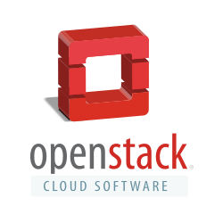

There are multiple ways to expose a Kubernetes Service. If you've ever run on any managed Kubernetes service on cloud (**EKS, GKE, LKE, etc.**), [the cloud controller manager](https://kubernetes.io/docs/concepts/architecture/cloud-controller/#service-controller) handles it for you. But for clusters created from scratch with [VMs](https://www.vmware.com/topics/virtual-machine) or run on bare metal, you'll likely need to set it up yourself. And what if you don't have full control of the underlying APIs and can't use a cloud controller? Can you still expose your services?
In this article, I will go over options for OpenStack VMs and bare metal setups to help get past `<pending>` and expose your services.

## OpenStack Cloud Controller Manager (CCM)



The most common way to provision external IPs on OpenStack is to use the OpenStack Cloud Controller Manager **([CCM](https://github.com/kubernetes/cloud-provider-openstack/blob/master/docs/openstack-cloud-controller-manager/using-openstack-cloud-controller-manager.md))**. This follows the standard Kubernetes cloud-controller-manager architecture, where the cloud controller is responsible for creating and managing load balancers and assigning external IPs.
This approach assumes you have OpenStack application credentials that can be injected into the cluster as a Kubernetes Secret. The CCM uses these credentials to provision an OpenStack load balancer on an internal subnet and, depending on your cloud configuration, associates a floating IP from a public network to expose the service externally.
The setup is typically as follows:

1. Create application credentials on OpenStack Horizon **(openrc.sh)**
2. Create a Secret containing your [**OpenStack application credentials**](https://github.com/kubernetes/cloud-provider-openstack/blob/master/manifests/controller-manager/cloud-config)
3. Install the [**OpenStack CCM manifests**](https://github.com/kubernetes/cloud-provider-openstack/blob/master/docs/openstack-cloud-controller-manager/using-openstack-cloud-controller-manager.md#global)
4. Create a Service of type `LoadBalancer`. The OpenStack CCM automatically provisions the load balancer and associates a floating IP to expose the service externally

### Pros

- Easy setup only requires installing the controller and applying the secret onto the cluster
- Uses the conventional Kubernetes cloud controller manager architecture
- No need to point to multiple A records

### Cons

- Infrastructure credentials and access needed (must be able to create load balancers and assign floating IPs)
- If defaults are not provided, must set up networks and security groups

## The Bare Metal Case: Cilium Node IPAM (Internet) or L2 Announcements (Local Networks)


This approach is ideal on bare metal when you control the Kubernetes installation.
By using [**Cilium**](https://cilium.io/) as the cluster CNI, you gain additional IP Address Management (IPAM) capabilities. Two common options are available:

- [**Node IPAM**](https://docs.cilium.io/en/stable/network/node-ipam/), which exposes Services using the external IPs of eligible Kubernetes nodes.
- [**L2 Announcements**](https://docs.cilium.io/en/stable/network/l2-announcements/), which allocate virtual IPs from a **CiliumLoadBalancerIPPool** and advertise them over Layer 2, providing functionality similar to MetalLB.
  The setup is typically as follows:

1. Enable either `nodeIPAM.enabled: true` or `l2announcements.enabled: true` in the Cilium Helm values
2. Install Cilium using Helm or the Cilium CLI with the desired configuration
3. For L2 announcements, create a `CiliumLoadBalancerIPPool` and a `CiliumL2AnnouncementPolicy`
4. Create Services of type `LoadBalancer`. For node IPAM mode it will assign the external ip from eligible node IPs itself, and for L2 Announcements it
   will assign the external ip from the defined `CiliumLoadBalancerIPPool`

This approach works well when you can still point to multiple A records, allowing traffic to continue reaching healthy nodes if one becomes unavailable.
If your Services only need to be accessible on a private network, L2 Announcements are often a better choice. Rather than exposing node IPs, Cilium advertises a virtual IP from a LoadBalancerIPPool. If the node currently advertising that IP fails, another node automatically takes over the advertisement, providing transparent failover. This is particularly useful when combined with a VPN such as Tailscale for secure remote access.

### Pros

- No infrastructure API needed
- Easy to set up with Helm Chart
- Handles failover as long as DNS points to multiple A records (Node IPAM), and automatic failover (L2 announcements)
- Covers the L2 case without needing an external component, i.e., MetalLB
- Best in class container networking interface (CNI), uses eBPF which provides an L3/L4 observability layer and other benefits for free

### Cons

- Hard initial setup, must be able to create the cluster and install Cilium as the CNI
- External DNS must point to multiple A records

## Traefik (DaemonSet + hostNetwork)


This approach is useful when you do not have access to the underlying cloud APIs, but you can still modify resources within the Kubernetes cluster.
In this setup, [Traefik](https://doc.traefik.io/traefik/) runs as a DaemonSet with hostNetwork mode enabled, allowing it to listen directly on each node's network interfaces.
Since Traefik is reachable through each node's external IP, clients can access the ingress by connecting directly to those node IPs.
The setup is typically as follows:

1. Configure the Traefik Helm values with:

```yaml
deployment:
  kind: DaemonSet
hostNetwork: true
serviceType: ClusterIP
```

1.
2. Deploy the Traefik chart.
3. Traefik runs on every node and is reachable through each node's external IP.

### Pros

- No infrastructure API needed
- Easy to set up with Helm Chart
- Exposes services even without having cloud controller or being able to create the K8s cluster.

### Cons

- Automatic failover not provided
- Traefik must run in DaemonSet mode (one pod per node)
- External DNS must be able to point to multiple A records

## Wrapping Up

Exposing services on a bare metal or OpenStack cluster might be tricky but not impossible.
If you have API access on OpenStack, the **OpenStack CCM** is the standard solution and requires very little DNS management (one A record only). For bare-metal clusters where you can create the Kubernetes cluster but do not have access to other primitives (load balancers and floating IPs), **Cilium** offers the best balance: Node IPAM for simplicity with multiple A records, or L2 Announcements for automatic failover on local networks. Lastly, without API access or cluster creation control, **Traefik in hostNetwork mode** is a quick option that can still expose services but lacks failover.
Ultimately, the right approach depends on your access and environment.
