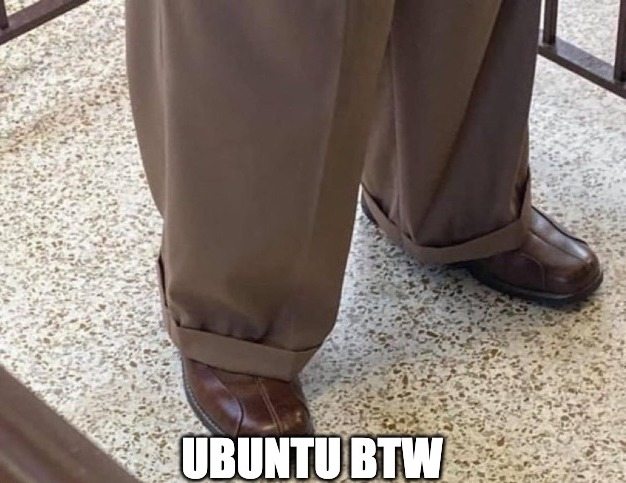
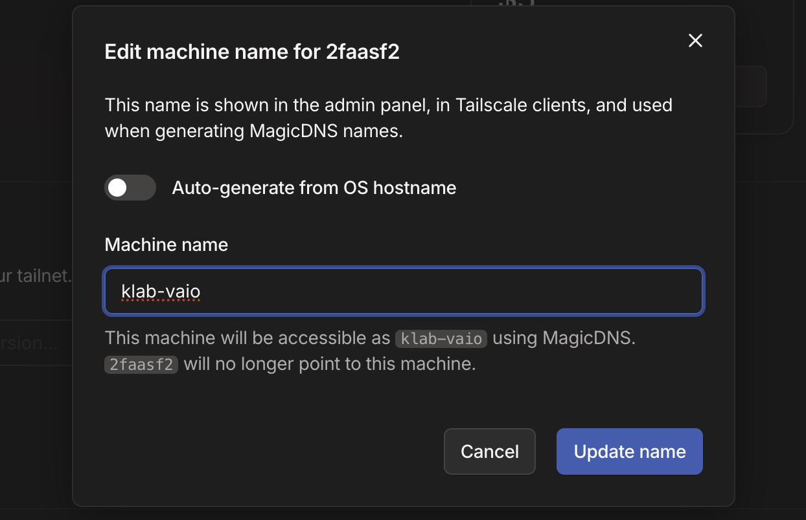

This year I want to really up my **DevOps**/**Platform Engineering** skills to the next level, as it is an area I am very interested in. After having such a great experience diving into **Kubernetes** for the [NSDF Intersect](https://nationalsciencedatafabric.org/nsdf-intersect) project,
I thought that it is finally time go full throttle into building my own **mini homelab playground**.

Usually, when people think of a homelab, they picture a **huge server rack** with boxes upon boxes upon boxes... and, of course, a money tree 😁. However, If you are like me, chances are you want
to build a **test lab**, one that can serve you to experiment different [cloud-native technologies](https://landscape.cncf.io/) and strategies.

The plan is to start from just a barebones **Linux distro** and end up running my own **Kubernetes cluster**. Along the way, I'll look into
hosting few services from a simple static site to a personal media server. The possibilities are truly endless in the world of homelabs.

In this series, I will document my hardware, decision, and progress of the **Kinho's Homelab** adding piece by piece as I research and gain more knowledge. This is going to be fun! (and yes, we shall know [pain](https://www.youtube.com/shorts/xu7X5-5U-b0)).
For this first article in the series, I’ll cover **setting up my first node and securing it under a tailnet with WireGuard** using [Tailscale](https://tailscale.com/).

---

## Grandma's Laptop Has a Use!

As I mentioned earlier, the goal is to build a homelab that works as a playground for experimentation which means even your **grandma’s old laptop** will work too.

For me, that is an old [Sony VAIO VPCEH](https://vaiolibrary.com/VPCEH), Core i3 2310M, 4GB SDRAM DDR3, and 512GB HDD. This machine is barely holding on under all the Windows bloatware, but it is ready to be reborn. To give new life to this poor soul, we will revitalize it with **Linux**.

---

## Choosing a Linux Distro



When deciding which distro to flash onto the VAIO, I considered a few such as [Fedora](https://www.fedoraproject.org/server/), [Arch](https://archlinux.org/) btw, and even more k8s-suitable ones such as [Talos](https://www.talos.dev/). However, I’ll wear the boomer pants for now and go with **Ubuntu**.

The simple fact is I actually do not mind Ubuntu. In fact, any **Linux is 10⁶ times better than Windows**. It’s stable, and that is what we want here: a **solid environment**. Even though our main goal is experimentation, we do not want to deal with random breakages during operations. Don't get me wrong, Arch will get its shot in the future, but for now, it is **Ubuntu btw**.

If you have never flashed an OS before, you can follow these simple steps to [install Ubuntu server](https://ubuntu.com/tutorials/install-ubuntu-server#1-overview). Keep in mind that the image used in that tutorial is for a server environment, which is fine if you plan to use the laptop as a server only.  
However, you can also go with the [Ubuntu Desktop](https://ubuntu.com/tutorials/install-ubuntu-desktop#1-overview) image, if you intend to use the laptop as your daily driver as well.

---

## Reaching Cluster Nodes Remotely

The first issue I wanted to tackle was [SSH](https://en.wikipedia.org/wiki/Secure_Shell) access to my VAIO from my Macbook. It’s very likely that I’ll be outside my local network at some point, and managing SSH access through authorized keys across multiple machines quickly becomes a hassle. I needed a solution that would enable **secure access without constantly juggling keys or reconfiguring SSH**.

While researching ways to achieve this, I came across the fantastic [Tailscale](https://tailscale.com/), and honestly, I was amazed to what it had in store.

---

## Tailscale


**Tailscale** creates secure, point-to-point connectivity between devices using [WireGuard](https://www.wireguard.com/), forming what’s known as a **tailnet**. That means I can connect from my MacBook to my VAIO over SSH completely privately and, most importantly, securely.

Even better, the [personal](https://tailscale.com/pricing?plan=personal) tier is incredibly generous, including up to **100 devices and 3 users**. Not to glaze over it, but the setup was _incredibly easy_, which is always something I love to praise when trying out a new product.
However, if you are more of FOSS person, I highly recommend checking the [Headscale Project](https://github.com/juanfont/headscale) as an option to self-host Tailscale's control server. **Headscale** implements a single tailnet, being well-suited for personal use.

### Installing Tailscale

To set up my MacBook, I simply downloaded the [Tailscale client](https://tailscale.com/download/mac) from the official site and continued from there.  
For my VAIO running Linux, joining the mesh was as simple as running:

```bash
curl -fsSL https://tailscale.com/install.sh | sh
```

Then, we can start the Tailscale daemon as follows:

```bash
sudo tailscale up --ssh
```

Importantly, here we pass the `--ssh` flag to activate [Tailscale SSH](https://tailscale.com/kb/1193/tailscale-ssh).
The idea here is to ditch SSH login via password, and even SSH keys as there is a configuration overhead per machine added.

Tailscale SSH encrypts the connection over **WireGuard** using **Tailscale node keys** that are automatically
generated and expire after each session. It even enforces authentication for high-risk connections (like root logins). Very neat!

Just like that, I can now connect from my Macbook to my VAIO via SSH privately and securely.

---

### Adding MagicDNS + Tailscale SSH to Manage SSH Login

While we could SSH simply using the convention **hostname@tailscale-ip**, that becomes quite hard to remember, especially as we add more
devices to the tailnet. Fortunately, we could make use of [MagicDNS](https://tailscale.com/kb/1081/magicdns) which allow us to automatically **register DNS
names for devices in our network**. That way, we can substitute our raw Tailscale IP for a readable name.



Now, I can access my machine with a much better convention over SSH and simply authenticate on Tailscale to achieve an encrypted connnection as follows:

```bash
ssh hostname@machine-name
```

Awesome, now there is one more thing to take care of to finish securing the machine.

---

### Raise the Wall

We will do a few things to raise the wall. First, let's setup our **sshd_config** to only listen to its private IP
defined in Tailscale.

```plaintext {filename="sshd_config"}
ListenAddress <your-tailscale-ip>
```

Also, we will configure `ufw` to allow access to SSH only from Tailscale IP [CIDR](https://k1nho.github.io/blog/posts/what-is-cidr/) range with the following
command.

```bash
sudo ufw allow from '100.64.0.0/10' to any port 22
```

Configuring for IPV6 as well.

```bash
sudo ufw allow from 'fda7:115c:a1e0::/48' to any port 22
```

We deny access from any other IP to SSH.

```bash
sudo ufw deny 22
```

```bash
sudo ufw deny OpenSSH
```

Lastly, let's enable the firewall.

```bash
sudo ufw enable
```

---

## Wrapping up

That’s a solid start for **Kinho’s Homelab**! We took an old VAIO laptop that was gathering dust and gave it a new purpose as our first node. We **installed Ubuntu** (sorry Arch 😅), configured secure remote access with **Tailscale**, and locked it down properly with **ufw** and SSH hardening.

I am also very excited to test out other features that Tailscale enables such as [serve](https://tailscale.com/kb/1312/serve) for **routing traffic from my devices
to a local service** running on my tailnet, and experiment with [funnels](https://tailscale.com/kb/1223/funnel) to **route traffic from the internet to a local service on my tailnet**.

With the foundation in place, the next step will be our installation of **Kubernetes** to start experimenting and slowly build up services. There is still a lot of fun ahead, but we are off to a great start.

**Next: TBD**

## Resources

- [Ubuntu Server Installation](https://ubuntu.com/tutorials/install-ubuntu-server#1-overview)
- [Tailscale](https://tailscale.com/)
- [SSH authentication Methods and their differences](https://infisical.com/blog/ssh-certificates-guide)
