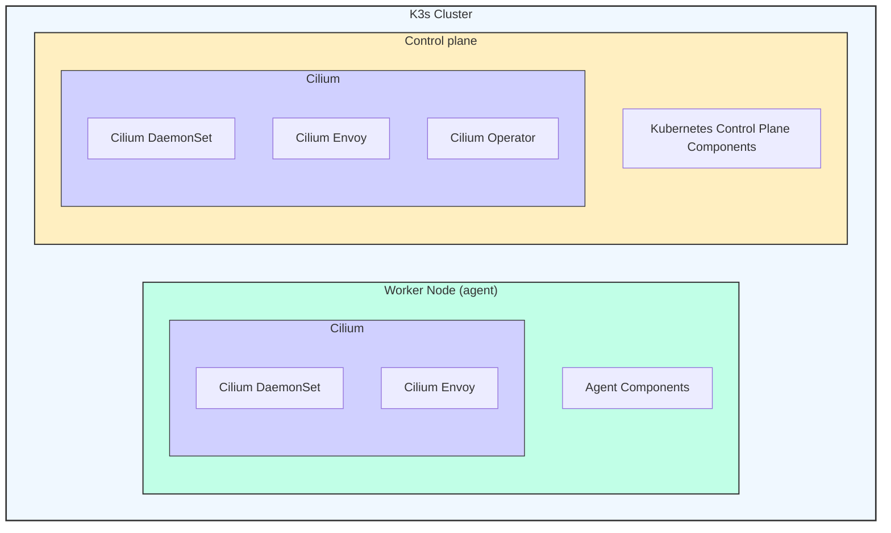

Welcome to another entry in the **Kinho's Homelab Series**. We're picking up where we left off in the previous entry [**Securing my Network with Tailscale**](),
and today we continue by installing the Greek engineering helmsman ⎈, the almighty [**Kubernetes**](https://kubernetes.io/). This will serve as our main orchestration platform to
run all the applications we want in our lab throughout the series.

We will make some modifications to improve the base installation of [k3s](https://k3s.io/) by adding the powerful [Cilium](https://cilium.io/) as our **CNI plugin and kube-proxy replacement**. Along the way, I'll discuss a few decisions regarding the configuration of all of this software.

---

# 2. Orchestration Platform and Networking (K3s + Cilium)


---

## Deciding on a Kubernetes Distro


Rolling your own Kubernetes on-prem can usually be done in multiple ways. You could go for [Kubernetes the Hard Way](https://github.com/kelseyhightower/kubernetes-the-hard-way) if you really want to understand
the guts of Kubernetes, installing each component to create the control plane, such as the **container runtime**, **etcd distributed key-value database**, **API server**, **controller manager**, **scheduler**, **kubelet**, and so on.

A more practical way of installing Kubernetes is with [kubeadm](https://kubernetes.io/docs/setup/production-environment/tools/kubeadm/), which makes the process much easier. You
can follow along this fantastic [iximiuz labs tutorial](https://labs.iximiuz.com/tutorials/provision-k8s-kubeadm-900d1e53) if you’re interested in setting it up.

All that said, in the previous entry we reviewed [grandma's laptop]() specs, which are indeed very tight (until I bring a more powerful node as **the control plane**). Considering that, I needed a **lighter Kubernetes distribution**. Enter [k3s](https://docs.k3s.io/), a fully compliant Kubernetes distribution by the [Rancher team](https://www.rancher.com/) that is great for edge, embedded, and of course our use case: **homelab**.

---

## Installing k3s

We want to prepare the installation of **Cilium** as our CNI; therefore, we'll apply some custom configuration options when installing k3s. That roughly translates to doing a bare minimum k3s installation by disabling built-in components: **Flannel CNI, Traefik, ServiceLB, and kube-proxy**.

### Configuring the Control Plane

We can set up the options in a unified YAML file, which we can pass to the k3s installation script. The configuration is as follows:

```k3sconfig.yaml
flannel-backend: "none"
disable-kube-proxy: true
disable-network-policy: true
disable:
  - traefik
  - servicelb
cluster-init: true
```

Note how I specify the `cluster-init` field so that the cluster initializes with embedded `etcd` rather than the default SQLite. You can check all the possible configuration options for the server [here](https://docs.k3s.io/cli/server).

> [!NOTE]
> If you are planning to run a single-node setup with no SSD, I recommend sticking with the SQLite setup. But in the long run, if you plan on **adding more nodes** to your cluster, installing `etcd` can provide you with a fully [HA setup](https://docs.k3s.io/datastore/ha-embedded).

> [!WARNING]
> The kubeconfig file at `/etc/rancher/k3s/k3s.yaml` is owned by root and written with a default mode of 600. This is actually good because changing it to 644
> would allow it to be read by other unprivileged users on the host.

Let's install k3s with the configuration file by running the following command:

```bash
curl -sfL https://get.k3s.io | INSTALL_K3S_EXEC="server" sh -s - --config=$HOME/k3sconfig.yaml
```

Now, if we check our cluster, we should see the following:

```bash
sudo kubectl get no
```

```console
NAME      STATUS   ROLES                AGE    VERSION
sliffer   Ready    control-plane,etcd   0s     v1.34.3+k3s1
```

Notably, if we take a look at **coredns**, **local-path-provisioner**, and **metrics-server** running in the `kube-system` namespace, they are in a **pending** state. That is because they rely on the CNI to start up.
If you went with the default installation of k3s, everything should work. However, we will prepare **Cilium** to take over these components.

```bash
sudo kubectl get po -n kube-system
```

```console
NAME                                      READY   STATUS    RESTARTS       AGE
coredns-7f496c8d7d-pd7v9                  0/1     Pending   0              1m
local-path-provisioner-578895bd58-v5vmk   0/1     Pending   0              1m
metrics-server-7b9c9c4b9c-jgwz4           0/1     Pending   0              1m
```

### Adding Worker Nodes (Optional)

If you want to expand your cluster with additional worker nodes, start by retrieving the token located at `/var/lib/rancher/k3s/server/token` using the following command:

```bash
sudo cat /var/lib/rancher/k3s/server/token
```

Similar to how we set up our control plane, we specify the following configuration for our agent node:

```k3sagent.yaml
token: <your-k3s-token>
server: https://<your-ip>:<your-port>
```

> [!TIP]
> If you want, you can add **node labels** to easily identify certain nodes. For example, to label a node as a worker, you can provide the following:
>
> ```k3sagent.yaml
> node-label:
>   node-role.kubernetes.io/worker=true
> ```

Lastly, we install k3s on the agent using the following command:

```bash
curl -sfL https://get.k3s.io | INSTALL_K3S_EXEC="agent" sh -s - --config=$HOME/k3sagent.yaml
```

Checking the status of our nodes with `kubectl`:

```bash
kubectl get no
```

```console
NAME      STATUS   ROLES                AGE    VERSION
kuriboh   Ready    worker               1m     v1.34.3+k3s1
sliffer   Ready    control-plane,etcd   3m     v1.34.3+k3s1
```

---

## About the CNCF Landscape

")

The [CNCF Landscape](https://landscape.cncf.io/?view-mode=grid) can be intimidating with the large number of projects available that contribute to modern cloud computing in different categories, such as orchestration with the golden child **Kubernetes**, mature coordination and discovery with **CoreDNS**, and continuous delivery systems that enable GitOps, such as **Argo CD** and **Flux**. It can be really easy to spend a whole day scrolling through the different projects and learning about their use cases.

In the past, I had known about **Cilium**, but I did not fully understand what it did, partly because I was new to Kubernetes and partly because I had not seen how its functionalities fit into the larger landscape. Now, let's get practical about why we want to configure **Cilium** in our k3s cluster.

---

## Unifying the Cluster's Network with Cilium


From the [official website](https://cilium.io/), we get the following definition:

> Cilium is an open source, cloud native solution for providing, securing, and observing network connectivity between workloads, fueled by the revolutionary Kernel technology eBPF

In the previous section, we purposely disabled most of the k3s built-ins related to networking, including **Flannel CNI**, **Traefik LB**, **ServiceLB**, and **kube-proxy**. Each of these components corresponds to a specific layer in our networking stack. This is where **Cilium** comes in. We will use it to unify our networking stack, serving as our CNI plugin for pod networking, providing L4 service routing, and acting as an L7 load balancer for setting up **Gateway API and ingress**.

### How Can Cilium Achieve All of That?


Cilium is based on [eBPF](https://ebpf.io/), a powerful technology that can **dynamically program the kernel**. This enables more performant routing that is not based on traditional iptables, as is the case with **kube-proxy**. Its **eBPF hashmaps** enable constant-time performance, unlike the linear scans used by iptables. This means that as the number of services grows, performance stays consistent.

Not only that, but because Cilium integrates neatly with the Linux kernel, it provides **network observability and security policies** for our cluster.

Whereas other CNIs provide basic connectivity, Cilium offers powerful features such as:

- **Faster native pod-to-pod networking with eBPF (no iptables overhead)**
- **Real-time L3/L4 observability with [Hubble](https://docs.cilium.io/en/stable/overview/intro/)**
- **Built-in security with WireGuard encryption**
- **Advanced network policy enforcement at multiple layers**
- **MetalLB replacement with LB IPAM and L2 announcements**

Needless to say, Cilium is much more than just a **CNI**. It is a key component that provides a fast, secure, and observable network stack adaptable to many needs.

---

## Installing Cilium

### Downloading the CLI

Cilium can be installed in a couple of ways, either via Helm charts or with its CLI. We will install the [Cilium CLI](https://docs.cilium.io/en/latest/gettingstarted/k8s-install-default/#install-the-cilium-cli) for Linux using the following command:

```bash
CILIUM_CLI_VERSION=$(curl -s https://raw.githubusercontent.com/cilium/cilium-cli/main/stable.txt)
CLI_ARCH=amd64
if [ "$(uname -m)" = "aarch64" ]; then CLI_ARCH=arm64; fi
curl -L --fail --remote-name-all https://github.com/cilium/cilium-cli/releases/download/${CILIUM_CLI_VERSION}/cilium-linux-${CLI_ARCH}.tar.gz{,.sha256sum}
sha256sum --check cilium-linux-${CLI_ARCH}.tar.gz.sha256sum
sudo tar xzvfC cilium-linux-${CLI_ARCH}.tar.gz /usr/local/bin
rm cilium-linux-${CLI_ARCH}.tar.gz{,.sha256sum}
```

### Configuring Cilium Installation

Now that we have the CLI, we install Cilium. Before doing that, we need the CLI to have access to the cluster, so we will set the `KUBECONFIG` environment
variable to point to our `k3s.yaml` file at `/etc/rancher/k3s/k3s.yaml`. If you want, you can move the file to its usual location under `.kube/config` using the following:

```bash
mkdir -p $HOME/.kube
sudo cp -i /etc/rancher/k3s/k3s.yaml $HOME/.kube/config
echo "export KUBECONFIG=$HOME/.kube/config" >> $HOME/.bashrc
source $HOME/.bashrc
```

We will now specify an `IP` and `PORT` for our installation. For the port, we can use the [default API server port](https://kubernetes.io/docs/reference/networking/ports-and-protocols/#control-plane). For the IP, configure a static IP for this machine at your gateway, then use that IP here. We can install Cilium with the following command:

```bash
IP=<YOUR-IP>
PORT=<YOUR-PORT>
cilium install --set k8sServiceHost=${IP} \
--set k8sServicePort=${PORT} \
--set kubeProxyReplacement=true \
--set hubble.relay.enabled=true \
--set hubble.ui.enabled=true \
--set ipam.operator.clusterPoolIPv4PodCIDRList="10.42.0.0/16"
```

> [!NOTE]
> By default, Cilium uses `cluster-pool-ipv4-cidr: 10.0.0.0/8` for its IPAM. That default can conflict with k3s’s PodCIDR (`10.42.0.0/16`), which will break cross-node pod communication if pods get IPs outside the intended range. To avoid this, explicitly set:
>
> ```yaml
> ipam.operator.clusterPoolIPv4PodCIDRList="10.42.0.0/16"
> ```
>
> You can also set the IPAM mode to kubernetes, if you would like cilium to pick up the PodCIDR from the kubernetes **v1.Node object**.
>
> ```yaml
> ipam.mode=kubernetes
> ```
>
> For more details, see the [Cilium IPAM documentation](https://docs.cilium.io/en/stable/network/concepts/ipam/).

Let's check our installation status with the following command:

```bash
cilium status --wait
```


Finally, if we check our previous core components under the `kube-system` namespace that were in pending state:

```console
NAME                                      READY   STATUS    RESTARTS       AGE
coredns-7f496c8d7d-pd7v9                  1/1     Running   0              3m
local-path-provisioner-578895bd58-v5vmk   1/1     Running   0              3m
metrics-server-7b9c9c4b9c-jgwz4           1/1     Running   0              3m
```

### Network Traffic Observability with Hubble

Let's bring up the **Hubble UI** to observe network traffic flow. For this demonstration, I'll show traffic from the **argocd** namespace
(a sneak peek of what's coming in the next article about **GitOps**!)

```bash
kubectl port-forward service/hubble-ui -n kube-system  8080:80
```


Very cool! Just like that we can see all our resources in the namespace, and the network connections between them. Notably,
we see that the `argocd-repo-server` has an egress to the `world`, in other words, the internet. Let's take
a look more deeply into our network traffic table.


We see that traffic is routed from pod with IP `10.42.0.12` to destination IP `140.82.112.3` via `443/TCP`. That destination IP might ring some bells
as to what the `argocd-repo-server` traffic is to, we can do some dns inspection with **dig** like so:

```bash
dig -x 140.82.112.3  +short
```

```console
lb-140-82-112-3-iad.github.com.
```

Aha! It is `github.com` load balancer IP. This makes sense since Argo will try to sync from the state declared as source which is my github repository.

---

At this point, our cluster should be fully connected with Cilium and all the appropriate components running on both the control plane and worker nodes:



> [!TIP]
> Run the Cilium connectivity test to make sure everything is working correctly:
>
> ```bash
> cilium connectivity test
> ```

---

## Wrapping Up

That's it for this entry! We've made tremendous progress at the Homelab. We installed **k3s** as kubernetes distro of choice for orchestration and unified the network stack with **Cilium**, replacing the default **Flannel CNI, kube-proxy**, and other built-ins.

I'm particularly excited at exploring more of Cilium's capabilities. Hubble already is an incredible component that comes out of the box for L3/L4 observability, and the sneak peek of ArgoCD's network traffic was just a taste of what's possible!

We now have our own **orchestration platform**, but it's looking a little empty. Not only that, but all of our installations to the cluster have been manual; we certainly need to improve this. In the next entry, we will start setting up some applications to run in the cluster and work on transitioning into a **GitOps** workflow! There's still plenty of exciting work ahead. Catch you in the next one.

- **Previous:** [Kinho's Homelab Series - Securing my Network with Tailscale]()

- **Next: TBD**

## Resources

- [K3s](https://docs.k3s.io/)
- [Cilium](https://cilium.io/)
- [Hubble](https://docs.cilium.io/en/stable/overview/intro/)
