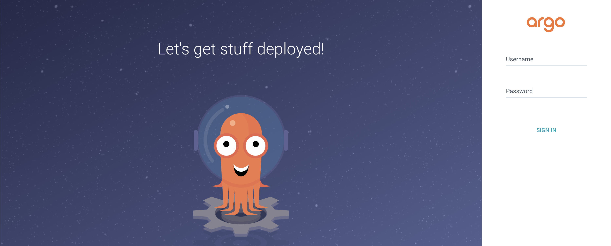

Welcome to another entry in the **Kinho's Homelab Series**, in the last [entry](), we setup our orchestration platform with K3s and solidified our network
stack with Cilium. However, At this point we have built a whole Kubernetes cluster whose only job is to exist, no apps, no workloads just vibes.

On top of that, installation of Helm charts such as the one for Cilium were installed by hand, which means there’s no structure, no repeatability, and no easy way to rebuild.
Before we can run real workloads, we need a proper, automated way to manage how all of our Kubernetes objects are installed and configured. It's finally time to adopt the **GitOps workflow**!

In this entry, I will introduce [Argo CD](https://argo-cd.readthedocs.io/en/stable/) as our continuous delivery solution for our Kubernetes cluster. We will also take a look at one of the tricky parts of a GitOps workflow in **secret management strategies**. Lastly, we'll install the **Tailscale operator** to end up deploying our first app. Go ahead and take a drink, this will be a fun one!

---

# 3. GitOps, Secrets, and First Application


---

## What is Argo CD ?


From the official [Argo CD documentation ](https://argo-cd.readthedocs.io/en/stable/), we get a very simple definition:

> Argo CD is a declarative, GitOps continuous delivery tool for Kubernetes.

The key part here is in **GitOps**, so we must define what it is. From [Gitlab's post on GitOps](https://about.gitlab.com/topics/gitops/):

> GitOps is an operational framework that applies DevOps practices like version control, collaboration, and CI/CD to infrastructure automation, ensuring consistent, repeatable deployments.
> Teams put GitOps into practice by using Git repositories as the single source of truth, automating deployments, and enforcing changes through merge requests or pull requests.
> Any configuration drift, such as manual changes or errors, is overwritten by GitOps automation so the environment converges on the desired state defined in Git.

In Layman's term, just as how we use version control for application code and merge changes that fix bugs or implement a feature, we can do so too with our infrastructure.
In this case, every pull request represents a change in our infrastructure, and then a tool runs in a **reconciliation loop** to make sure the cluster state matches the desired state defined in **Git**.

The tool that we will use to achieve our **GitOps workflow** for the homelab will indeed be **Argo**!

---

### Installing Argo CD

Installing Argo is as simple as applying its CRD's with the following command:

```bash
kubectl create namespace argocd
kubectl apply -n argocd -f https://raw.githubusercontent.com/argoproj/argo-cd/stable/manifests/install.yaml
```

We need to pick up the initial admin password created, so that we can login into the dashboard, and change it.

```bash
kubectl get secret argocd-initial-admin-secret -n argocd -ojsonpath='{.data.password}' | base64 -d
```

From then on, we can access the argocd-server for now lets expose it locally via port-forward.

```bash
kubectl port-forward svc/argocd-server -n argocd 8080:443
```



### Bootstrapping the Cluster

The Argo UI is very nice, however, using it to create applications and resources defeats the purpose of setting up a declarative GitOps workflow. We want to use Git as the centralized source
of truth of the cluster. As such, we'll use the [app of apps pattern](https://argo-cd.readthedocs.io/en/stable/operator-manual/declarative-setup/#app-of-apps) to easily manage the state of the cluster. Any changes to the cluster will be logically related to a commit. We let Argo sync the cluster using our repository to apply the
necessary resources.

To bootstrap the cluster with Argo, we'll apply an Application CRD from Argo to trigger all the other applications that will be installed.

```yaml {filename="bootstrap/root.yaml", linenos=true ,hl_lines=[11, 15]}
apiVersion: argoproj.io/v1alpha1
kind: Application
metadata:
  name: bootstrap
  namespace: argocd
  annotations:
    argocd.argoproj.io/sync-wave: "-1" # system level priority on sync (https://argo-cd.readthedocs.io/en/stable/user-guide/sync-waves/)
spec:
  project: default
  sources:
    - repoURL: https://github.com/k1nho/homelab
      targetRevision: main
      path: argo
  destination:
    server: https://kubernetes.default.svc
    namespace: argocd
  syncPolicy:
    automated:
      prune: true
      selfHeal: true
```

- **Line 11** defines the url for the repository that we want Argo to sync from. In this case, its my own repository.
- **Line 15** defines the destination where this app will be deployed, we use the `https://kubernetes.default.svc` convention to say that it will be the local cluster.
- In the **sync policy**, we specify automatic **pruning** (delete resources if they are no longer defined in Git) and **self-healing** (revert any changes that cause drift from the cluster state defined in Git)

---

## Strategy for Managing Secrets

Many of the applications we will run require [secrets](https://kubernetes.io/docs/concepts/configuration/secret/), however as you might have already noticed we are managing our cluster publicly and we will like not to be another one in the list of the [39 million secrets leaked on Github](https://resources.github.com/enterprise/understanding-secret-leak-exposure/) 😅. That begs the question:

> **How can we introduce secrets into the cluster in an automated way without leaking them?**

There are two popular choices to manage secrets within a GitOps workflow either with a **Secrets Operations Encryption** [(SOPS)](), or with an **External Secret Operator** [(ESO)]().

### SOPS and ESO

The **SOPS** approach encrypts secrets that you can push into the repository such that decryption happens only within the cluster. This avoids the common pitfall of plaintext leaked secrets. Some of
the best choices for this approach are [Sealed Secrets](http://github.com/bitnami-labs/sealed-secrets), and [age](https://github.com/FiloSottile/age). On the other hand, we have the **ESO** approach
in which we pull secrets from an external manager **Azure Vault**, **AWS Secret Manager**, or **GCP Secret Manager** via an operator and sync them into Kubernetes (either directly into the pod that needs it or within a Secret object). The main idea here is once again
to avoid plaintext secrets and keeps the repository secret-free. So which one should we choose?

Initially, I considered using [Bitnami's sealed secrets](http://github.com/bitnami-labs/sealed-secrets) which is simple enough to setup; however, there's a few things that made me actually choose a **ESO**, namely
**secret rotation** and **API based secret management**. With **sealed secrets**, we would need to re-encrypt our secrets every single time we want to rotate the current secrets
this is not too bad, but it becomes a bit manual. Moreover, having an API to create, fetch, and renovate secrets becomes incredibly important in CI/CD pipelines. While,
we have **usual suspects**[^1] to choose from, I discovered [Infisical](https://infisical.com/) a poweful open source all in one secret management platform.

### The Infisical ESO


Through this series, I like to consider this three as my bastions for choosing a particular software: **the project is open source, has a generous free tier, and can, if one chooses to, be self-hosted!**
Infisical meets this criteria, and when I consider that they have both a [Kubernetes Operator](https://infisical.com/docs/integrations/platforms/kubernetes/overview) and an [SDK](https://infisical.com/docs/sdks/overview)
it ends up fullfilling the other requirements: **sync secrets into our cluster**, and **manage them with an API**. Let's define our Argo App to deploy the infisical secrets operator.

```yaml {filename="argo/infisical.yaml", linenos=true, hl_lines=[11,16, 28]}
apiVersion: argoproj.io/v1alpha1
kind: Application
metadata:
  name: infisical-secrets-operator
  namespace: argocd
  annotations:
    argocd.argoproj.io/sync-wave: "0" # cluster level priority on sync (https://argo-cd.readthedocs.io/en/stable/user-guide/sync-waves/)
spec:
  project: default
  sources:
    - repoURL: https://dl.cloudsmith.io/public/infisical/helm-charts/helm/charts/
      chart: secrets-operator
      targetRevision: 0.10.3
      helm:
        valueFiles:
          - $values/cluster/infisical-operator/infisical-values.yaml
    - repoURL: https://github.com/k1nho/homelab
      targetRevision: main
      ref: values
  destination:
    server: https://kubernetes.default.svc
    namespace: infisical-secrets-operator
  syncPolicy:
    automated:
      prune: true
      selfHeal: true
    syncOptions:
      - CreateNamespace=true
```

The spec is similar to how we defined the bootstrap application with some differences:

- **Line 11** defines the repository url where the helm chart of the operator is hosted
- **Line 16** defines a path in our repository where our custom values for the operator's helm chart are defined
- **Line 28** sets the `CreateNamespace` variable to true, so that it can create the `infisical-secrets-operator` namespace resource if it does not exist.

Let's test the **infisical ESO** in the next section where we will need an oauth secret for our **tailscale operator**.

---

## Installing the Tailscale Operator

The [tailscale kubernetes operator](https://tailscale.com/kb/1236/kubernetes-operator) enables:

- Securing access to the Kubernetes control plane
- Exposing cluster workloads to the tailnet (Ingress)
- Exposing a tailnet service to the Kubernetes cluster (Egress)

There are many more possibilities as listed in [the official documentation](https://tailscale.com/kb/1236/kubernetes-operator), for this case we are interested
in **exposing our cluster workloads to the tailnet**, that is, using it as ingress. As usual, we will configure our tailscale operator as an ArgoCD app to deploy
the Helm chart into the cluster with some custom values.

```yaml {filename="argo/tailscale.yaml"}
apiVersion: argoproj.io/v1alpha1
kind: Application
metadata:
  name: tailscale-operator
  namespace: argocd
  annotations:
    argocd.argoproj.io/sync-wave: "1" # app level priority on sync (https://argo-cd.readthedocs.io/en/stable/user-guide/sync-waves/)
spec:
  project: default
  sources:
    # Kustomize
    - repoURL: https://github.com/k1nho/homelab
      targetRevision: main
      path: apps/tailscale-operator

    - repoURL: https://pkgs.tailscale.com/helmcharts
      chart: tailscale-operator
      targetRevision: 1.90.9
      helm:
        valueFiles:
          - $values/apps/tailscale-operator/tailscale-operator-values.yaml

    - repoURL: https://github.com/k1nho/homelab
      targetRevision: main
      ref: values

  destination:
    server: https://kubernetes.default.svc
    namespace: tailscale-operator
  syncPolicy:
    automated:
      prune: true
      selfHeal: true
    syncOptions:
      - CreateNamespace=true
```

### Adding the Oauth Secret

Notice we define the path `apps/tailscale-operator` this will pick up our `kustomization.yaml` definition, that packs the Infisical Secret CRD `operator-oauth-secret.yaml`:

```yaml {filename="apps/tailscale-operator/tailscale-operator-values.yaml"}
apiVersion: secrets.infisical.com/v1alpha1
kind: InfisicalSecret
metadata:
  name: operator-oauth
spec:
  authentication:
    universalAuth:
      secretsScope:
        projectSlug: homelab-d-s7-g

        envSlug: "prod"
        secretsPath: "/tailscale"
      credentialsRef:
        secretName: universal-auth-credentials
        secretNamespace: infisical-secrets-operator

  managedKubeSecretReferences:
    - secretName: operator-oauth
      secretNamespace: tailscale-operator
```

---

## The First Application

We are ready to deploy the first application into our cluster. For the first app, we are not going with anything crazy, but something simple enough
to demonstrate that our cluster is running properly to deploy services. We will go for a classic [stateless application](https://kubernetes.io/docs/tutorials/stateless-application/),
and what a better one than this blog itself!

### Setting Up a CI Pipeline with Github Actions and Dagger

To be able to define declarative our workload, we will need to create some Kubernetes resources that will be pushed into our repository for Argo to sync. More importantly,
we do not have an image for the blog, so let's get started by creating a pipeline that will build our image when we push a tag in the blog repository.

#### Initializing Dagger Module

Let's start by initializing our dagger module this is where our CI code will live.

```bash
dagger init --sdk=go --name=blog-ci
```

The following will create the `.dagger` directory with some boiler plate, I choose [Go](https://go.dev/) for the sdk, but feel free
to choose any language from their [available sdks](https://docs.dagger.io/getting-started/api/sdk/).

#### Build CI

In order to have a container image to use for our Kubernetes deployment, we need to have a pipeline
that will build and publish the container image. Let's start with the build.

```go {filename=".dagger/main.go"}
// Build container from Dockerfile
func (m *BlogCi) BuildFromDockerfile(
	// +defaultPath="/"
	source *dagger.Directory,
	platform dagger.Platform,
	tags ImageTags,
	// +default="http://localhost:8080/"
	base_url string,
) *dagger.Container {
	return dag.Container(dagger.ContainerOpts{Platform: platform}).
		Build(source, dagger.ContainerBuildOpts{
			BuildArgs: []dagger.BuildArg{
				dagger.BuildArg{Name: "BASE_URL", Value: base_url},
				dagger.BuildArg{Name: "GIT_SHA", Value: tags.SHA},
				dagger.BuildArg{Name: "VERSION", Value: tags.Version},
			},
		}).
		WithLabel("org.opencontainers.image.created", time.Now().UTC().Format(time.RFC3339))
}
```

We define the `BuildFromDockerfile` that takes some parameters:

- `source`: the directory where the Dockerfile is located
- `platform`: the specific platform variant, i.e, linux/amd64
- `tags`: A struct that contains both semantic version and github sha
- `base_url`: Hugo specific base url for the website

This will return a dagger container correctly tagged and ready to be published to a container registry.

#### Publish CI

Now, that we have a dagger function that will built a container from us, we can publish that container
by providing the specified parameters.

```go {filename=".dagger/main.go", linenos=true, hl_lines=["26-30"]}
// Publish Docker image to registry
func (m *BlogCi) PublishImage(ctx context.Context, name string,
	// +default="latest"
	version string,
	sha string,
	// +default="ttl.sh"
	registry string,
	username string,
	password *dagger.Secret,
	// +defaultPath="/"
	source *dagger.Directory,
) (string, error) {

	platforms := []dagger.Platform{
		"linux/amd64",
		"linux/arm64",
	}
	platformVariants := make([]*dagger.Container, 0, len(platforms))
	for _, platform := range platforms {
		platformVariants = append(platformVariants, m.BuildFromDockerfile(source, platform, ImageTags{Version: version, SHA: sha}, "http://localhost:8080/"))
	}

	imageName := fmt.Sprintf("%s/%s/%s:%s", registry, username, name, version)
	ctr := dag.Container()

	if registry != "ttl.sh" {
		ctr = ctr.WithRegistryAuth(registry, username, password)
	} else {
		imageName = fmt.Sprintf("%s/%s-%.0f", registry, name, math.Floor(rand.Float64()*10000000))
	}

	return ctr.Publish(ctx, imageName, dagger.ContainerPublishOpts{PlatformVariants: platformVariants})
}
```

The logic from line 26-30 help us test the pipeline locally by publishing the container image to [ttl.sh](https://ttl.sh/),
and if we provide a different registry such as **ghcr.io** or **dockerhub**, it will apply the registry auth.

#### Finishing the pipeline with Github Actions

Lastly, we can wrap our dagger call and have a simple github action that will run when we publish a tag as follows:

```yaml {filename=".github/workflows/publish.yaml"}
name: Publish Blog Image

on:
  push:
    tags:
      - "**"
jobs:
  publish:
    runs-on: ubuntu-24.04
    permissions:
      contents: read
      packages: write
    env:
      NAME: kinho-blog
      USERNAME: ${{github.repository_owner}}
      SHA_TAG: ${{github.sha}}
      SEMVER_TAG: ${{github.ref_name}}

    steps:
      - name: Checkout repository
        uses: actions/checkout@v4
        with:
          submodules: true
          fetch-depth: 0
      - uses: dagger/dagger-for-github@8.0.0

      - name: Publish Blog Docker Image to ghcr
        env:
          PASSWORD: ${{ secrets.GITHUB_TOKEN }}
        run: |
          dagger call publish-image --registry=ghcr.io --name=$NAME --version=latest --sha=$SHA_TAG --username=$USERNAME --password=env:PASSWORD # latest
          dagger call publish-image --registry=ghcr.io --name=$NAME --version=$SEMVER_TAG --sha=$SHA_TAG --username=$USERNAME --password=env:PASSWORD # semver
          dagger call publish-image --registry=ghcr.io --name=$NAME --version=$SHA_TAG --sha=$SHA_TAG --username=$USERNAME --password=env:PASSWORD # sha
```

### Exposing the Blog

All that's left is to define our blog resources to be applied by Argo.

---

## Wrapping up

That's it for this entry! we started by migrating our existing Cilium deployment into a declarative GitOps workflow which led us to the introduction of ArgoCD. From there
we adopted Argo's App of Apps pattern and setup Infisical as our secret management solution, and the tailscale operator. Lastly, we deployed the blog as the first
application, and expose it with the Tailscale Ingress!

The cluster is now alive with the blog running! but there are many more improvements needed. First, we have deployed multiple applications but we have to monitor effectively
the resource compsumption and traffic of the different services in our cluster. Moreover, we have not had the need for a database to **persistently store information**, when the time comes (and it will come) a solution
for provisioning storage, backup, and a disaster recovery strategy becomes important to keep data safe. In the next entry, we'll explore a few of these!

- **Previous: [Kinho's Homelab Series - Orchestration Platform and Networking (K3s + Cilium)]()**
- **Next: TBD**

---

## Resources

- [What is GitOps ?](https://about.gitlab.com/topics/gitops/)
- [Argo CD Documentation](https://docs.k3s.io/)
- [Infisical Kubernetes Operator](https://infisical.com/docs/integrations/platforms/kubernetes/overview)
- [Tailscale Kubernetes Operator](https://tailscale.com/kb/1236/kubernetes-operator)
- [Cilium](https://cilium.io/)

[^1]: [Azure Vault](https://azure.microsoft.com/en-us/products/key-vault), [AWS Secret Manager](https://aws.amazon.com/secrets-manager/), [GCP Secret Manager](https://cloud.google.com/security/products/secret-manager)
