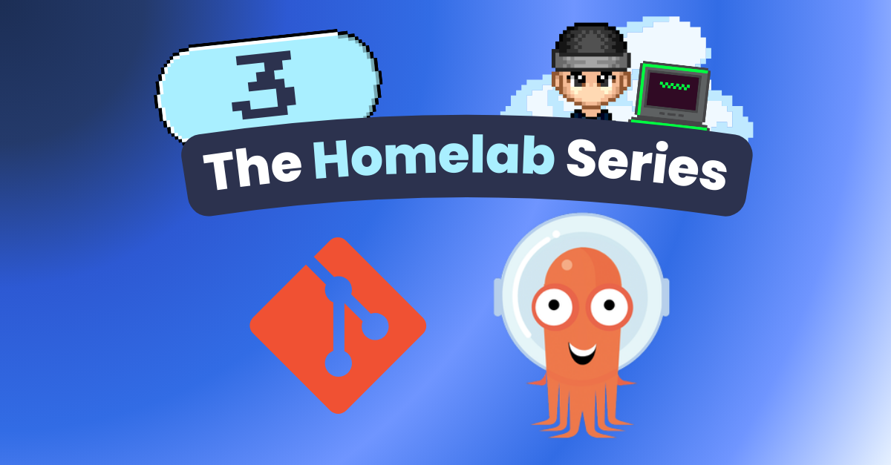
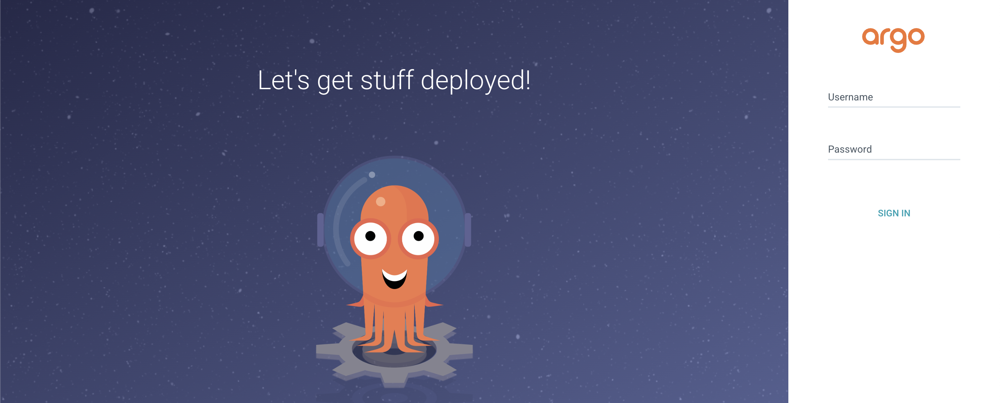
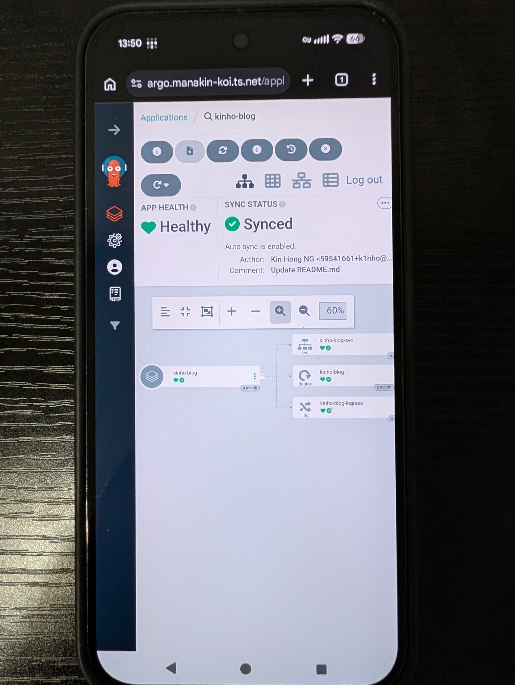

Welcome to another entry in **Kinho's Homelab Series**! In the last [entry](), we set up our orchestration platform with K3s and solidified our network
stack with Cilium. However, at this point we have built a whole Kubernetes cluster whose only job is to exist. It has no apps, no workloads, just vibes.

On top of that, Helm charts such as the one for Cilium were installed by hand, which means there's no structure, no repeatability, and no easy way to rebuild.
Before we can run real workloads, we need a proper, automated way to manage how all of our Kubernetes objects are installed and configured. It's finally time to adopt the **GitOps workflow**!

In this entry, I'll introduce [Argo CD](https://argo-cd.readthedocs.io/en/stable/) as our continuous delivery solution for our Kubernetes cluster. We'll also take a look at one of the trickiest parts of a GitOps workflow: **secret management strategies**. Finally, we'll install the **Tailscale operator** and deploy our first applications. Go ahead and grab a drink, this will be a fun one!

---

# 3. GitOps, Secrets, and First Application



---

## What is Argo CD?


From the official [Argo CD documentation](https://argo-cd.readthedocs.io/en/stable/), we get a very simple definition:

> Argo CD is a declarative, GitOps continuous delivery tool for Kubernetes.

The key part here is in **GitOps**, so we must define what it is. From [Gitlab's post on GitOps](https://about.gitlab.com/topics/gitops/):

> GitOps is an operational framework that applies DevOps practices like version control, collaboration, and CI/CD to infrastructure automation, ensuring consistent, repeatable deployments.
> Teams put GitOps into practice by using Git repositories as the single source of truth, automating deployments, and enforcing changes through merge requests or pull requests.
> Any configuration drift, such as manual changes or errors, is overwritten by GitOps automation so the environment converges on the desired state defined in Git.

In other words, just like how we use version control for application code and merge changes that fix bugs or implement a feature, we can do the same with our Kubernetes infrastructure.
In this case, every pull request represents a change to our infrastructure, and then a tool runs in a **reconciliation loop** to make sure the cluster state matches the desired state defined in **Git**.

The tool we'll use to achieve our **GitOps workflow** for the homelab will indeed be **Argo CD**!

---

### Installing Argo CD

Installing Argo is as simple as applying its CRDs with the following command:

```bash
kubectl create namespace argocd
kubectl apply -n argocd -f https://raw.githubusercontent.com/argoproj/argo-cd/stable/manifests/install.yaml
```

We need to grab the initial admin password so we can log in to the dashboard and change it.

```bash
kubectl get secret argocd-initial-admin-secret -n argocd -ojsonpath='{.data.password}' | base64 -d
```

We can now access the argocd-server. For now, let's expose it locally via port-forward.

```bash
kubectl port-forward svc/argocd-server -n argocd 8080:443
```



### Bootstrapping the Cluster

The Argo UI is very nice, however, using it to create applications and resources defeats the purpose of setting up a declarative GitOps workflow. We want to use Git as the single source of truth for the cluster. As such, we'll use the [app of apps pattern](https://argo-cd.readthedocs.io/en/stable/operator-manual/declarative-setup/#app-of-apps) to easily manage the state of the cluster. Any changes to the cluster will be logically related to a commit. We let Argo sync the cluster using our repository to apply the
necessary resources.

To bootstrap the cluster, we'll apply an **Application CRD** from Argo to trigger all the other applications that will be installed.

```yaml {filename="bootstrap/root.yaml", linenos=true ,hl_lines=[11, 15]}
apiVersion: argoproj.io/v1alpha1
kind: Application
metadata:
  name: bootstrap
  namespace: argocd
  annotations:
    argocd.argoproj.io/sync-wave: "-1" # system level priority on sync (https://argo-cd.readthedocs.io/en/stable/user-guide/sync-waves/)
spec:
  project: default
  sources:
    - repoURL: https://github.com/k1nho/homelab
      targetRevision: main
      path: argo
  destination:
    server: https://kubernetes.default.svc
    namespace: argocd
  syncPolicy:
    automated:
      prune: true
      selfHeal: true
```

- **Line 11** defines the URL for the repository that we want Argo to sync from. In this case, it's my own repository.
- **Line 15** defines the destination where this app will be deployed; we use the `https://kubernetes.default.svc` convention to say that it will be the local cluster.
- In the **sync policy**, we specify automatic **pruning** (delete resources if they are no longer defined in Git) and **self-healing** (revert any changes that cause drift from the cluster state defined in Git)

---

## Strategy for Managing Secrets

Many of the applications we will run require [secrets](https://kubernetes.io/docs/concepts/configuration/secret/), however, as you might have already noticed we're managing our cluster publicly and we don't want to be another one in the list of the [39 million secrets leaked on Github](https://resources.github.com/enterprise/understanding-secret-leak-exposure/) 😅. That begs the question:

> **How can we introduce secrets into the cluster in an automated way without leaking them?**

There are two popular choices to manage secrets within a GitOps workflow: either with a **Secrets Operations Encryption** [(SOPS)](), or with an **External Secret Operator** [(ESO)]().

### SOPS and ESO

The **SOPS** approach encrypts secrets that you can push into the repository such that decryption happens only within the cluster. This avoids the common pitfall of plaintext leaked secrets. Some of
the best choices for this approach are [Sealed Secrets](http://github.com/bitnami-labs/sealed-secrets), and [age](https://github.com/FiloSottile/age). On the other hand, we have the **ESO** approach
in which we pull secrets from an external manager like **Azure Vault**, **AWS Secret Manager**, or **GCP Secret Manager** via an operator and sync them into Kubernetes (either directly into the pod that needs it or within a Secret object). The main idea here is once again
to avoid plaintext secrets and keep the repository secret-free. So which one should we choose?

Initially, I considered using [Bitnami's sealed secrets](http://github.com/bitnami-labs/sealed-secrets) which is simple enough to set up; however, there are a few things that made me actually choose an **ESO**, namely
**secret rotation** and **API-based secret management**. With **sealed secrets**, if we rotate the encryption keypair, we'd need to re-encrypt every one of the secrets.
This isn't too bad, but it becomes a bit manual. Moreover, having an API to create, fetch, and rotate secrets becomes incredibly important in CI/CD pipelines. While we have the **usual suspects**[^1] to choose from, I discovered [Infisical](https://infisical.com/), a powerful open source all-in-one secret management platform.

### The Infisical ESO


Through this series, I like to consider these three pillars for choosing a particular software:

- **The project is open source**
- **It has a generous free tier**
- **If one chooses to, it can be self-hosted!**

Infisical meets this criteria, and when I consider that they have both a [Kubernetes Operator](https://infisical.com/docs/integrations/platforms/kubernetes/overview) and an [SDK](https://infisical.com/docs/sdks/overview),
it ends up fulfilling the other requirements: **sync secrets into our cluster**, and **manage them with an API**. Let's define our Argo App to deploy the Infisical secrets operator.

```yaml {filename="argo/infisical.yaml", linenos=true, hl_lines=[11,16, 28]}
apiVersion: argoproj.io/v1alpha1
kind: Application
metadata:
  name: infisical-secrets-operator
  namespace: argocd
  annotations:
    argocd.argoproj.io/sync-wave: "0" # cluster level priority on sync (https://argo-cd.readthedocs.io/en/stable/user-guide/sync-waves/)
spec:
  project: default
  sources:
    - repoURL: https://dl.cloudsmith.io/public/infisical/helm-charts/helm/charts/
      chart: secrets-operator
      targetRevision: 0.10.3
      helm:
        valueFiles:
          - $values/cluster/infisical-operator/infisical-values.yaml
    - repoURL: https://github.com/k1nho/homelab
      targetRevision: main
      ref: values
  destination:
    server: https://kubernetes.default.svc
    namespace: infisical-secrets-operator
  syncPolicy:
    automated:
      prune: true
      selfHeal: true
    syncOptions:
      - CreateNamespace=true
```

The spec is similar to how we defined the bootstrap application with some differences:

- **Line 11** defines the repository URL where the Helm chart of the operator is hosted.
- **Line 16** defines a path in our repository where our custom values for the operator's Helm chart are defined.
- **Line 28** sets the `CreateNamespace` variable to true so that it can create the `infisical-secrets-operator` namespace resource if it does not exist.

Let's test the **Infisical ESO** in the next section where we'll need an OAuth secret for our **Tailscale operator**.

---

## Installing the Tailscale Operator

The [tailscale kubernetes operator](https://tailscale.com/kb/1236/kubernetes-operator) enables:

- **Securing access to the Kubernetes control plane**
- **Exposing cluster workloads to the tailnet (Ingress)**
- **Exposing a tailnet service to the Kubernetes cluster (Egress)**

There are many more possibilities as listed in [the official documentation](https://tailscale.com/kb/1236/kubernetes-operator), but for this case we're interested
in **exposing our cluster workloads to the tailnet**, which means using it as ingress. I'll also take a look at **securing access to the control plane using an API server proxy** to cover the remote case. As usual, we'll configure our Tailscale operator as an ArgoCD app to deploy
the Helm chart into the cluster with some custom values.

```yaml {filename="argo/tailscale.yaml"}
apiVersion: argoproj.io/v1alpha1
kind: Application
metadata:
  name: tailscale-operator
  namespace: argocd
  annotations:
    argocd.argoproj.io/sync-wave: "1" # app level priority on sync (https://argo-cd.readthedocs.io/en/stable/user-guide/sync-waves/)
spec:
  project: default
  sources:
    # Kustomize
    - repoURL: https://github.com/k1nho/homelab
      targetRevision: main
      path: apps/tailscale-operator

    - repoURL: https://pkgs.tailscale.com/helmcharts
      chart: tailscale-operator
      targetRevision: 1.90.9
      helm:
        valueFiles:
          - $values/apps/tailscale-operator/tailscale-operator-values.yaml

    - repoURL: https://github.com/k1nho/homelab
      targetRevision: main
      ref: values

  destination:
    server: https://kubernetes.default.svc
    namespace: tailscale-operator
  syncPolicy:
    automated:
      prune: true
      selfHeal: true
    syncOptions:
      - CreateNamespace=true
```

### Adding the OAuth Secret

Notice we define the path `apps/tailscale-operator`. This will pick up our `kustomization.yaml` definition, containing the Infisical Secret CRD `operator-oauth-secret.yaml`:

```yaml {filename="apps/tailscale-operator/tailscale-operator-values.yaml"}
apiVersion: secrets.infisical.com/v1alpha1
kind: InfisicalSecret
metadata:
  name: operator-oauth
spec:
  authentication:
    universalAuth:
      secretsScope:
        projectSlug: homelab-d-s7-g

        envSlug: "prod"
        secretsPath: "/tailscale"
      credentialsRef:
        secretName: universal-auth-credentials
        secretNamespace: infisical-secrets-operator

  managedKubeSecretReferences:
    - secretName: operator-oauth
      secretNamespace: tailscale-operator
```

### Configuring the Tailscale Operator as an API Server Proxy (Optional)

First, we need to configure access controls on Tailscale for the different groups.

```json
{
  "grants": [
    {
      "src": ["autogroup:admin"], // change to the group/host that needs access
      "dst": ["tag:k8s-operator"],
      "app": {
        "tailscale.com/cap/kubernetes": [
          {
            "impersonate": {
              "groups": ["system:masters"] // select the appropriate group to impersonate
            }
          }
        ]
      }
    }
  ]
}
```

> [!NOTE]
> If you already have some ACLs set up, it might drop traffic. You can write a quick test to check that access to the `tag:k8s-operator` at TCP/443 is possible. For example:
>
> ```json
> {
>   "tests": [
>     {
>       "src": "autogroup:admin",
>       "accept": ["tag:k8s-operator:443"]
>     }
>   ]
> }
> ```

Install the [helm chart](https://github.com/tailscale/tailscale/blob/main/cmd/k8s-operator/deploy/chart/values.yaml) with these `values.yaml`:

```yaml
apiServerProxyConfig:
  mode: "true" # "true", "false", "noauth"
  allowImpersonation: "true" # "true", "false"
```

#### Adding a Read-Only Cluster Role Binding

Lastly, we can create a cluster role binding to the `view` cluster role, which is read-only:

```yaml {filename="crb-tsreader.yaml"}
apiVersion: rbac.authorization.k8s.io/v1
kind: ClusterRoleBinding
metadata:
  name: tsreader
roleRef:
  apiGroup: rbac.authorization.k8s.io
  kind: ClusterRole
  name: view
subjects:
  - kind: Group
    name: tsreader
    apiGroup: rbac.authorization.k8s.io
```

Now, if we try to get the `clusterroles` resource, after impersonation has been set to `tsreader` in the ACLS we get:

```bash
kubectl get clusterroles
```

```console
Error from server (Forbidden): clusterroles.rbac.authorization.k8s.io is forbidden:
User "user@mail.com" cannot list resource "clusterroles" in API group "rbac.authorization.k8s.io" at the cluster scope
```

Very cool! For my little homelab this just solves remote access to the cluster, but this feature becomes incredibly powerful when working with teams that need to do proper access control of the Kubernetes resources for
different users and groups.

---

## First Applications

We are ready to deploy the first applications into our cluster. For the first app, we're not going with anything crazy, but something simple enough
to demonstrate that our cluster is running properly to deploy services. We'll go for a classic [stateless application](https://kubernetes.io/docs/tutorials/stateless-application/),
and what better one than this blog itself!

I made a full breakdown of the pipeline to build and publish this image using Dagger and Github actions that you can check [here]().

### Exposing the Blog

All that's left is to define our blog resources to be applied by Argo. In particular, we'll use the [Tailscale ingress](https://tailscale.com/kb/1439/kubernetes-operator-cluster-ingress#exposing-cluster-workloads-using-a-kubernetes-ingress) class to expose the service to the tailnet with an [FQDN](https://www.hostinger.com/tutorials/fqdn) that we can use to access it in our authorized devices.

```yaml
apiVersion: networking.k8s.io/v1
kind: Ingress
metadata:
  name: kinho-blog-ingress
spec:
  defaultBackend:
    service:
      name: kinho-blog-svc
      port:
        number: 80
  ingressClassName: tailscale
  tls:
    - hosts:
        - blog
```

### Exposing the ArgoCD UI

Lastly, we'll also get the Argo UI exposed. This service is already available from our original installation of Argo, so we can simply create the ingress resource for it.

```yaml
apiVersion: networking.k8s.io/v1
kind: Ingress
metadata:
  name: argocd-ingress
spec:
  defaultBackend:
    service:
      name: argocd-server
      port:
        number: 443
  ingressClassName: tailscale
  tls:
    - hosts:
        - argo
```

Now, if we check our ingresses:

```bash
kubectl get ingress -A
```

```console
NAMESPACE    NAME                 CLASS       HOSTS   ADDRESS                       PORTS     AGE
kinho-blog   kinho-blog-ingress   tailscale   *       blog.manakin-koi.ts.net       80, 443   1d
argocd       argocd-ingress       tailscale   *       argo.manakin-koi.ts.net       80, 443   1d
```

Since we're using Tailscale as the `ingressClassName`, we can access it on any of our authorized devices described in our ACL. Here I am accessing the
Argo UI on my phone, very cool!



---

## Wrapping up

That's it for this entry! I started by looking into the implementation of the GitOps workflow, which led me to the introduction of ArgoCD. From there, I:

- Adopted Argo's app of apps pattern
- Set up Infisical as our external secret operator for handling secrets in the cluster
- Installed the Tailscale operator to provision ingress and remote access
- Ran the first applications of the cluster: the blog and Argo UI
- Used the GitOps workflow throughout all the installations!

The cluster is now alive with the blog running! But there are many more improvements needed. First, we've deployed multiple applications, but we need to effectively
monitor the resource consumption of our services. Moreover, we haven't had the need for a database to **persistently store information**. When the time comes (and it will come), a solution
for provisioning storage, backup, and a disaster recovery strategy becomes important to keep data safe. In the next entry, we'll explore a few of these!

- **Previous:** [Kinho's Homelab Series - Orchestration Platform and Networking (K3s + Cilium)]()
- **Next:** TBD

---

## Resources

- [What is GitOps?](https://about.gitlab.com/topics/gitops/)
- [Argo CD Documentation](https://argo-cd.readthedocs.io/en/stable/)
- [Infisical Kubernetes Operator](https://infisical.com/docs/integrations/platforms/kubernetes/overview)
- [Tailscale Kubernetes Operator](https://tailscale.com/kb/1236/kubernetes-operator)
- [Exposing Cluster Workloads to the Tailnet Using Ingress](https://tailscale.com/kb/1439/kubernetes-operator-cluster-ingress#exposing-cluster-workloads-using-a-kubernetes-ingress)
- [Securing Access to the Control Plane with Tailscale](https://tailscale.com/kb/1437/kubernetes-operator-api-server-proxy)
- [My Homelab Repository](https://github.com/k1nho/homelab)

[^1]: [Azure Vault](https://azure.microsoft.com/en-us/products/key-vault), [AWS Secret Manager](https://aws.amazon.com/secrets-manager/), [GCP Secret Manager](https://cloud.google.com/security/products/secret-manager)
