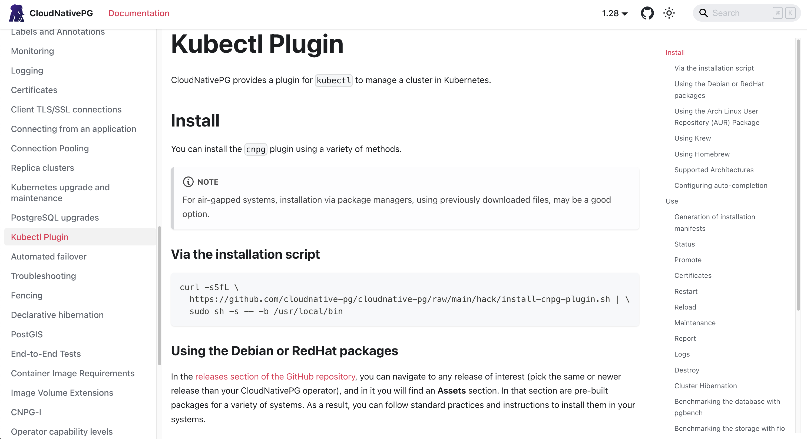
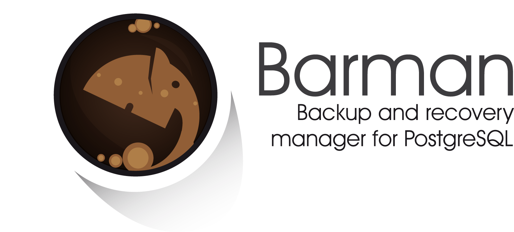
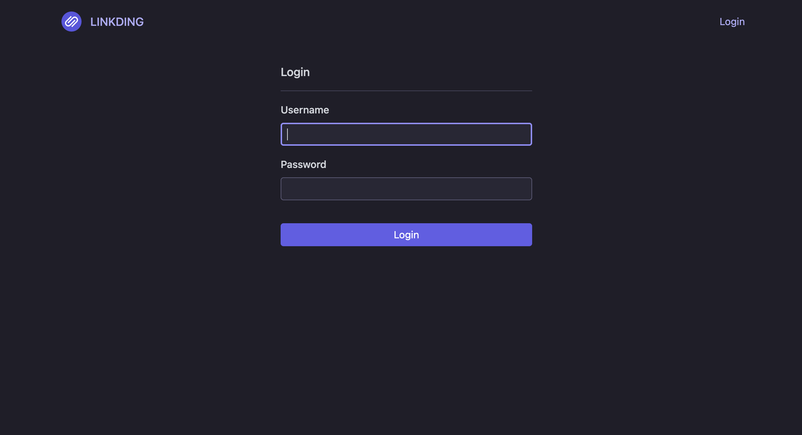
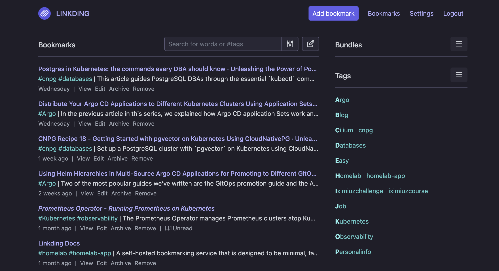

Welcome to another entry in **Kinho's Homelab Series**! In the last [entry](), we created the foundation for all our Kubernetes
infrastructure by adopting the GitOps workflow with Argo CD. So far, I have deployed the blog which belongs in the category of [stateless applications](https://kubernetes.io/docs/tutorials/stateless-application/).
It is time to kick it up a notch by running [stateful applications](https://kubernetes.io/docs/tutorials/stateful-application/).

In this entry, I'll go over running **PostgreSQL in Kubernetes**, and setup **the Linkding bookmark manager** application to use it. Along the way, I discuss why you want
to avoid the usual _recommended_ way of running stateful applications in the form of the **StatefulSet**, and opt for a more reliable and proven management, in this case of
PostgreSQL, with the use of an **operator**.

---

# 3. PostgreSQL databases and Linkding


---

## Kubernetes and Databases: a Debate for the Ages

Just like editor, or language wars, storage has always been a topic of debate in Kubernetes. By default, the Kubernetes documentation explains that using the **StatefulSet** object is useful for managing applications
that need persistent storage:

> A StatefulSet runs a group of Pods, and maintains a sticky identity for each of those Pods. This is useful for managing applications that need persistent storage or a stable, unique network identity.

However, Kubernetes has always been know as a **container orchestrator**, although I like to think about it as [data types for your infrastructure](), and by the nature
of containers therefore ephemeral, meaning that it contradicts the very own nature of storage, that is, being persistent. The challenge has sparked the debate since the birth of Kuberentes of whether or
not databases should even be ran on Kubernetes in the first place. This conumdrum has resulted in people usually looking for alternatives such as migrating the database service to a dedicated server outside of the k8s cluster, or
opt-out for a cloud manage service for an specific database.

The conclusion should simply be to avoid databases in Kubernetes at all costs, right? Recently, while watching the talk [Why are we still talking about containers?](https://www.youtube.com/watch?v=x1t2GPChhX8) by the distinguish Google engineer Kelsey Hightower,
a question comes up:

> Should we run databases in Kubernetes?

Kelsey's answer goes something like this:

> It used to be no, because I watched people lose their data. My guess is people are still losing their data! but the tools are just so much better: **volume snapshotting, restoring, and replication**.

Yes, containers are ephemeral, yes, data can be easily loss if you run StatefulSets blindly. Then, is it even possible to reach a solution that would enable us easily have **the tooling** in place
such that it combines the knowledge of Kubernetes patterns, and deep expertise of database management. Fortunately, with Kubernetes adoption across multiple cloud providers and on-premise, many
have set out the task to do just that by using the powerful: **operator pattern**.

---

### The Operator Pattern

One of the most powerful, if not the most critical, pattern in Kubernetes is [the operator pattern](https://kubernetes.io/docs/concepts/extend-kubernetes/operator/), but what is it? From Kubernetes official docs:

> The operator pattern aims to capture the key aim of a human operator who is managing a service or set of services. Human operators who look after specific applications and services have deep knowledge of how the system ought to behave, how to deploy it, and how to react if there are problems.

Wow isn't that just what we would like to have for our databases! human operators with deep knowledge of how a system out to behave, except there is no human and it is automated
to handle the scenarios where things eventually can go wrong. To that end, the operator pattern has emerged as the best way to manage databases in Kubernetes.

### StatefulSet vs Operator

We discuss the operator pattern, but why would you just choose it over the StatefulSet primitive? For starters running databases is not a one and done job, it requires careful failover logic whenever your primary fails for
that it must detect failure, promote a replica, and update services, this is non-trivial and can be easy to get wrong. Moreover, replication is manual you must account for replication slots, WAL streaming configuration to name a few. Lastly, and perhaps most
importantly there is not an automated way to do backups, or recovery.

Even in the simple of cases such as role-aware services, you can see how running a simple StatefulSet does not account for the myriad of possibilities that somebody must perform to
keep a database running, let alone in an ephemeral by nature environment as it is the case with Kubernetes.

---

## PostgreSQL Databases in Kubernetes (CloudNativePG Operator)


Today, I'll take a look at the [CloudNativePG](https://cloudnative-pg.io/) project for my homelab to start running PostgreSQL databases. The **CloudNativePG** operator
is an extremely powerful operator that encompasses the full operational lifecycle of a highly available PostgreSQL cluster. Initially, it was built by experts over at [EnterpriseDB](https://www.enterprisedb.com/products/edb-postgres-ai-for-cloudnativepg),
and eventually became an [incubated project](https://landscape.cncf.io/?item=app-definition-and-development--database--cloudnativepg) under the CNCF.

---

### The CNPG Operator

As usual, we'll create our Argo `Application` custom resource to install the CNPG operator via GitOps.

> [!NOTE]
> If you missed the previous entry were we go over ArgoCD you can check it [here](())

```yaml {filename="argo/cnpg.yaml"}
apiVersion: argoproj.io/v1alpha1
kind: Application
metadata:
  annotations:
    argocd.argoproj.io/sync-wave: "0"
  name: cnpg-homelab
  namespace: argocd
spec:
  project: default
  sources:
    # Kustomize
    - repoURL: https://github.com/k1nho/homelab.git
      targetRevision: HEAD
      path: apps/cnpg

    - repoURL: https://cloudnative-pg.github.io/charts
      chart: cloudnative-pg
      targetRevision: 0.27.1
      helm:
        valueFiles:
          - $values/apps/cnpg/cnpg-operator-values.yaml

    - repoURL: https://github.com/k1nho/homelab.git
      targetRevision: HEAD
      ref: values

  destination:
    namespace: cnpg-system
    server: https://kubernetes.default.svc

  syncPolicy:
    automated:
      prune: true
      selfHeal: true
    syncOptions:
      - CreateNamespace=true
      - ServerSideApply=true
```

---

### The CNPG kubectl plugin



The CNPG project provides a very nice plugin for kubectl to analyze the state of our deployed cluster and its associated databases. We will install it and work with it
in the next section. Using debian packages, we can install it as follows:

```bash
wget https://github.com/cloudnative-pg/cloudnative-pg/releases/download/v1.28.2/kubectl-cnpg_1.28.2_linux_x86_64.deb \
  --output-document kube-plugin.deb
```

```bash
sudo dpkg -i kube-plugin.deb
```

Check the appropriate installation from all the possible [installation options for the plugin](https://cloudnative-pg.io/docs/1.28/kubectl-plugin#install).

---

### Automated Backups and Recovery with CNPG



A key feature of a human operator is to be able to perform automated backups of our database. In CNPG land we can add the [backup](https://cloudnative-pg.io/docs/1.28/cloudnative-pg.v1#backupconfiguration) field to do just that. The configuration for backup allows us to define how the backups of the cluster are taken including `volumeSnapshots` and with [barman](https://pgbarman.org/) `barmanObjectStorage`.
A simple backup configuration can be as follows:

```yaml
backup:
  barmanObjectStore:
    destinationPath: s3://BUCKET_NAME/path/to/folder
    endpointURL: http://custom-endpoint:1234
    s3Credentials:
      accessKeyId:
        name: backup-creds
        key: ACCESS_KEY_ID
      secretAccessKey:
        name: backup-creds
        key: ACCESS_SECRET_KEY
    wal:
      compression: gzip
    data:
      compression: gzip
      encryption: AES256
      immediateCheckpoint: false
      jobs: 2
  retentionPolicy: "30d"
```

In this case we define the destination path where the backups will be in our bucket and the backend endpoint url. Next, we provide our credentials to connect to it, the
compression format for write-head logs and data, and the number of days to retain the data.

The `bootstrap` field provides multiple ways to start up the database including the [recovery option](https://cloudnative-pg.io/docs/1.28/bootstrap#bootstrap-from-a-backup-recovery)
which allows us to setup [boostrap from an object storage with the barman plugin](https://cloudnative-pg.io/docs/1.28/recovery#recovery-from-an-object-store-with-the-barman-cloud-plugin). This feature allows us to recover our PostgreSQL
database from an external object storage.

---

## Linkding Bookmark Manager

")

Recently, I've been doing a lot of research for the series and that includes reading documentation for the different technologies, and also blogs across the internet.
I have been bookmarking a lot, however, when it comes to retrieving a specific link it becomes buried and not easy to find. Moreover, I cannot maintain a consistent list when switching from one device to another. Let's fix that, I'll install the Linkding bookmark manager, a fantastic
application service to keep track and organize my different links by topics that I can then retrieve easily, this app uses SQlite by default, but we can provide a PostgreSQL database
now that we have our CNPG operator up and running!

### Preparing the Linkding Resources

Linkding is shipped as a container image, so for this installation we will organize our different manifests and complete the install with Kustomize.

First, we'll start with the deployment, this is a simple one that uses the container image of linkding.

```yaml {filename="apps/linkding/deployment.yaml"}
apiVersion: apps/v1
kind: Deployment
metadata:
  name: linkding
  labels:
    app: linkding
spec:
  replicas: 1
  selector:
    matchLabels:
      app: linkding
  template:
    metadata:
      labels:
        app: linkding
    spec:
      containers:
        - name: linkding
          image: ghcr.io/sissbruecker/linkding:1.45.0-alpine
          ports:
            - containerPort: 9090
          envFrom:
            - secretRef:
                name: linkding-env-vars
          resources:
            requests:
              cpu: "50m"
              memory: "128Mi"
            limits:
              memory: "256Mi"
```

Next, we can setup a service

```yaml {filename="apps/linkding/service.yaml"}
apiVersion: v1
kind: Service
metadata:
  name: linkding-svc
  labels:
    app: linkding
spec:
  type: ClusterIP
  selector:
    app: linkding
  ports:
    - port: 80
      targetPort: 9090
```

We'll setup the ingress as usual with the `tailscale` class.

```yaml {filename="apps/linkding/ingress.yaml"}
apiVersion: networking.k8s.io/v1
kind: Ingress
metadata:
  name: linkding-ingress
spec:
  defaultBackend:
    service:
      name: linkding-svc
      port:
        number: 80
  ingressClassName: tailscale
  tls:
    - hosts:
        - linkding
```

Lastly, we create the Argo `Application`.

```yaml {filename="argo/linkding.yaml"}
apiVersion: argoproj.io/v1alpha1
kind: Application
metadata:
  annotations:
    argocd.argoproj.io/sync-wave: "1"
  name: linkding-homelab
  namespace: argocd
spec:
  project: default
  source:
    path: apps/linkding
    repoURL: https://github.com/k1nho/homelab.git
    targetRevision: HEAD
  destination:
    namespace: linkding
    server: https://kubernetes.default.svc
  syncPolicy:
    automated:
      prune: true
      selfHeal: true
    syncOptions:
      - CreateNamespace=true
```

### Adding Secrets

<details>
<summary>How to add secrets?</summary>

For a full rundown on how to add secrets, check the last [entry]()!

</details>

We also need to add the necessary secrets which will be picked by our deployment via `linkding-env-vars`. Namely we provide
**LD_DB_DATABASE**,**LD_DB_HOST**, **LD_DB_PASSWORD**, **LD_DB_PORT**, **LD_DB_USER**, **LD_SUPERUSER_NAME**, and **LD_SUPERUSER_PASSWORD**. Lastly, we also need
to specify our **LD_DB_ENGINE** as postgres. For a full list, check the [linkding options](https://linkding.link/options/#list-of-options) page.

### Creating a PostgreSQL Cluster

We are now ready to create our PostgreSQL cluster declaratively using CNPG. For this, we create the `Cluster` custom resource provided by CNPG, we will create
this cluster to serve as the database for our [linkding](https://linkding.link/) application in the next section.

```yaml {filename="apps/linkding/db.yaml", lineNos=true}
apiVersion: postgresql.cnpg.io/v1
kind: Cluster
metadata:
  name: linkding-db
spec:
  instances: 3
  storage:
    # storageClass: "" # empty will use default
    size: 1Gi

  imageName: ghcr.io/cloudnative-pg/postgresql:18.3

  # Monitoring
  monitoring:
    enablePodMonitor: true

  # Bootstrap DB
  bootstrap:
    initdb:
      database: linkding
      owner: linkding
      secret:
        name: linkding-db-user-credentials
```

In this resource, we define the following:

- `instances: 3`: 3 databases should be up, one primary and two replicas.
- `size: 1Gi`: each database will have 1 Gibibyte of storage.
- `enablePodMonitor: true`: we will enable pod monitoring (useful for prometheus).
- Lastly, the bootstrap section instructs the operator to create the database with name `linkding` and owner `linkding` while also picking up the credentials for the database from a pre-created secret.

For a more comprehensive guide on all the knobs of the Cluster custom resource, check out the [examples](https://cloudnative-pg.io/docs/1.28/samples) and the official [specification](https://cloudnative-pg.io/docs/1.28/cloudnative-pg.v1#clusterspec).

After, our ArgoCD workflow will trigger and sync the resources into the cluster. Otherwise, you can apply directly using kustomize.

```bash
kubectl apply -k apps/linkding
```

### Checking the Cluster Resource

To check if our cluster resource has installed correctly, we can run the following:

```bash
kubectl get cluster linkding-db -n linkding
```

With enough time to allow all the instances to spawn up in the cluster, we'll eventually see the following:

```term
NAME          AGE   INSTANCES   READY   STATUS                     PRIMARY
linkding-db   1d    3           3       Cluster in healthy state   linkding-db-1
```

Great! just like that we have a fully ready PostgreSQL cluster with a primary and two replicas. Further inspecting our services we see the following:

```bash
kubectl get svc linkding-db -n linkding
```

```term
NAME             TYPE        CLUSTER-IP     EXTERNAL-IP   PORT(S)    AGE
linkding-db-r    ClusterIP   10.43.182.45   <none>        5432/TCP   1d
linkding-db-ro   ClusterIP   10.43.67.138   <none>        5432/TCP   1d
linkding-db-rw   ClusterIP   10.43.209.91   <none>        5432/TCP   1d
```

In this case 3 services are created:

- **linkding-db-rw**: the `rw` refers to **read-and-write** which is the primary.
- **linkding-db-ro**: the `ro` refers to **read-only** which is the replicas.
- **linkding-db-r**: the `r` refers to **read** which can be either the primary or the replicas.

This give us great flexibility out of the box to use a particular service depending on what our workload does with it.

### Checking the Status of the Cluster

Early on we installed the cnpg kubectl plugin, we will take advantage of it to get a high level overview of our cluster with the `status` command:

```bash
kubectl cnpg status linkding-db -n linkding
```

```terminal
Name                     linkding/linkding-db
System ID:               4839201756618043927
PostgreSQL Image:        ghcr.io/cloudnative-pg/postgresql:18.3
Primary instance:        linkding-db-1
Primary promotion time:  2026-04-26 01:47:32 +0000 UTC (1193h27m2s)
Status:                  Cluster in healthy state
Instances:               3
Ready instances:         3
Size:                    529M
Current Write LSN:       0/20000000 (Timeline: 1 - WAL File: 000000010000000000000020)

Continuous Backup not configured

Streaming Replication status
Replication Slots Enabled
Name           Sent LSN    Write LSN   Flush LSN   Replay LSN  Write Lag  Flush Lag  Replay Lag  State      Sync State  Sync Priority  Replication Slot
----           --------    ---------   ---------   ----------  ---------  ---------  ----------  -----      ----------  -------------  ----------------
linkding-db-2  0/20000000  0/20000000  0/20000000  0/20000000  00:00:00   00:00:00   00:00:00    streaming  async       0              active
linkding-db-3  0/20000000  0/20000000  0/20000000  0/20000000  00:00:00   00:00:00   00:00:00    streaming  async       0              active

Instances status
Name           Current LSN  Replication role  Status  QoS         Manager Version  Node
----           -----------  ----------------  ------  ---         ---------------  ----
linkding-db-1  0/20000000   Primary           OK      BestEffort  1.28.1           sliffer
linkding-db-2  0/20000000   Standby (async)   OK      BestEffort  1.28.1           sliffer
linkding-db-3  0/20000000   Standby (async)   OK      BestEffort  1.28.1           sliffer
```

Interestingly enough if we check for `StatefulSet` resources:

```bash
kubectl get sts -n linkding
```

```terminal
No resources found in linkding namespace.
```

We notice that the operator itself does not create any of them. This is because CNPG manages the Kubernetes storage primitive, that is `PersistentVolumes` and `PersistentVolumeClaim`, directly.

```bash
kubectl get pvc -n linkding
```

```terminal
NAME            STATUS   VOLUME                                     CAPACITY   ACCESS MODES   STORAGECLASS   VOLUMEATTRIBUTESCLASS   AGE
linkding-db-1   Bound    pvc-a4f93d8e-2c71-4b9f-8e6a-1d7c3f5a9b42   1Gi        RWO            local-path     <unset>                 1d
linkding-db-2   Bound    pvc-7b2e6c91-3f84-45da-9c21-6e8d4a7f2c10   1Gi        RWO            local-path     <unset>                 1d
linkding-db-3   Bound    pvc-5c8d1a2f-6e73-4f0b-b9a4-3d2f7c6e8b95   1Gi        RWO            local-path     <unset>                 1d
```

Indeed we see three `PersistentVolumeClaim` created associated with our three databases (primary, and two replicas). Notice here that the storage class is simply Rancher's [local-path](https://github.com/rancher/local-path-provisioner) that comes as part of the k3s installation,
but the same will happen with whatever `StorageClass` you select like [Longhorn](https://longhorn.io/) or [Promox CSI](https://github.com/sergelogvinov/proxmox-csi-plugin)

### Connecting to the PostgreSQL Primary

We can use the plugin as well to connect to our postgreSQL primary instance with the following:

```bash
kubectl cnpg psql linkding-db -n linkding
```

### Login into Linkding



### The Linkding Application



## Wrapping up

That’s it for this entry! I started by discussing a bit of background about running stateful applications in Kubernetes, talking about the `StatefulSet` primitive has its drawbacks and why the `Operator` pattern solves those.
Then, I moved into a practical implementation by setting the CNPG operator, and the resources for the Linkding application. Lastly, I ran a few commands that build up
more intuition for managing the postgreSQL cluster and end up seeing our application at work!

The cluster is now running a stateful application and we can tackle other applications that use relational databases as it is the case with Postgres! However,
we also want to look into object storage, this will be key for setting up services that need to store files. Most importantly there are already quite a few workloads running, but we are in the dark as far
as resource consumption goes, wouldn't it be nice to monitor all of it? I got a feeling that in the next entry will have greek fire 🔥 see you in the next one!

- **Previous:** [Kinho's Homelab Series - GitOps, Secrets, and First Applications]()
- **Next:** TBD

---

## Resources

- [CloudNativePG Documentation](https://cloudnative-pg.io/docs/1.28/)
- [Fantastic Article by Gabriele Bartolini (CNPG Maintainer) on the essential commands for DBA on Kubernetes](https://www.gabrielebartolini.it/articles/2025/10/postgres-in-kubernetes-the-commands-every-dba-should-know/)
- [The Operator Pattern](https://kubernetes.io/docs/concepts/extend-kubernetes/operator/)
