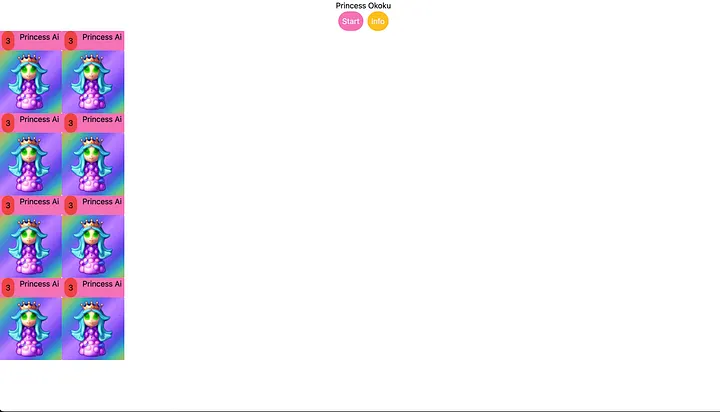
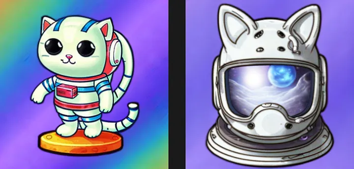
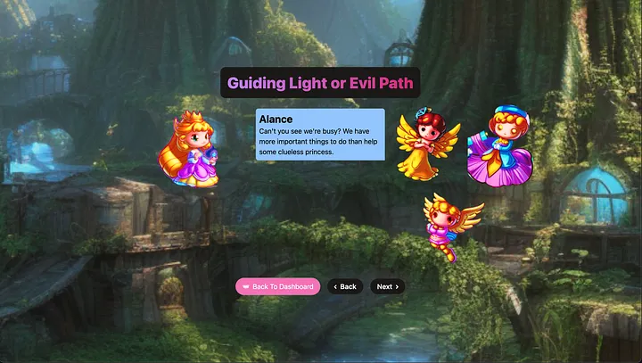
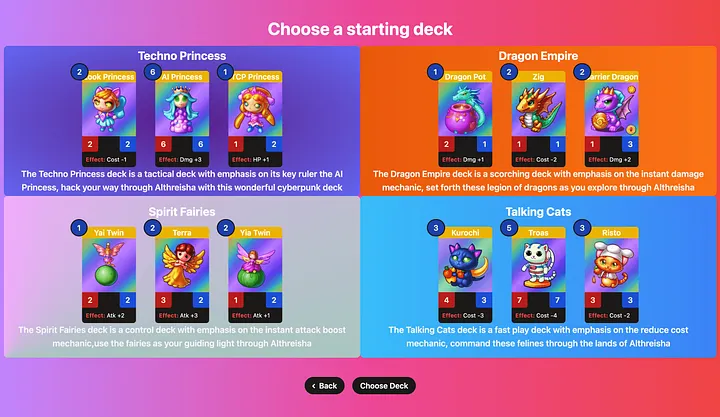

I recently participated in Rosebud.ai game jam, its 3rd entry focused on the extra cute theme. I ended up winning the game jam and in this post, I would like to take you on a journey from concept to creation of Princess Okoku,
the game I created using the amazing asset generator PixelVibe , ChatGPT, and React.

## React for Game Development ?

Hey don't start throwing the tomatoes! I am not a game developer, but I always have been a huge game fan, specially of rpgs, strategy and [gacha games](https://en.wikipedia.org/wiki/Gacha_game). In fact, one of my first tries of dabbling into game development dates back to almost 2–3 years ago
([The Programming Isekai Adventure](https://github.com/k1nho/gacha-game)) with a console based gacha game. When I saw that Rosebud open their 3rd game jam with the extra cute theme, I decided to give it a shot with my new skills.
However, my expertise is on web, so I had to make a choice.

## The Dragon Slayer or The Cooking Knife

Choosing what to use for the game came down to how fast I could ship the game given the time limit of the jam. I had the option of using Unity and while it was very enticing, learning Unity would take some time.
Thus, I decided to go with React. React is a cooking knife, but surely I might be able to turn it into a dragon slayer capable of making a game.

## Choosing a Game Concept

Initially, I though of going for a gacha game, it is fun and the easiness of asset generation provided by PixelVibe make it so that any character pull can be unique. However, I want it to go for a more enticing game mechanic
and that is when I decided to go for an strategy game. When I saw the cartoony items, I though it was a perfect match for a card game.
I decided to create 4 unique decks using PixelVibe each with their own game mechanic and storyline. I ended up with Cyberpunk Princesses, Dragons, Fairies, and Talking Cats as the 4 archetypes.



Moreover, each deck was carefully crafted by prompting PixelVibe to generate the assets. For example, take a look at the talking cats deck, Troas the astronaut cat also has a complementary spell card called the Heltroas
which was generated perfectly with the prompt “astronaut helmet with cat ears” using the Cartoony items model. Also, PixelVibe yields 4 variations of a single prompt at a time,
so one could decide which one fits better the theme. I personally liked this helmet, as it had the reflection of space which was a critical part of the talking cats story.



I was very satisfied with the results of the cartoony items model, so I decided to use the exoplanet and epic space environment models as well for story and battle backgrounds.
I would also like to see the model to have an option to create sprite sheets from a given image, as I was thinking on putting some animations for certain cards on battle.
Working with PixelVibe for game asset generation was a great experience. It allowed me to focus on coding the game without the overhead that I previously experienced when creating the art.

Aside from the core gameplay mechanics, the story was carefully created using ChatGPT. Initially, I wanted the story to be about a mystery, but then I went for a more philosophical meaning.
I think it turned out to be very good, I wanted the player to search for their own meaning about the story of Princess Okoku and the ending more or less reflects it. I personally enjoyed creating the 3rd story for the fairies world 😆.

> ChatGPT Prompt: Create a dialog for the following characters (Princess Kaede, Terra, Alance, and the Astro Fairy). Give the impression that although dragons though of fairies as humble and kind, they are actually extremely rude. Add remarks of how they hate dragons.



## Hardest Challenges

When it comes to game development, the challenges are far from scarce. In this section, I will explain the 3 most difficult challenges I faced when developing Princess Okoku.

## Tutorials are Hard

At first, I though of skipping the tutorial section, however, I though having this section was fundamental to set up the game right. First, it gives a summary of what the game its about and its story. Second, it allows the player to not start with a default deck, but rather choose the archetype they want to play right away from the four available. Then, I though of having a walkthrough to teach how a battle goes, but with short time, I had to cut this one down, specially after the 8 hour bug.



## The 8 hour bug (card stat mutation problem)

Yes, like the title reads, this bug took me 8 hours to fix. This happened right after the battle system was almost finalized. I noticed that when a player went into battle, the stats of the card after
battle would be permanently changed, even for static cards displayed in the dashboard. Despite many hours I could not find the bug, every function seemed to not mutate card state.
Luckily, having chosen Zustand as a state manager, I was able to quickly look in one spot to search for the bug since the state was centralized.
The culprit was found to be one of the first ever functions I had created (even previous to introducing zustand!) the getCard function. Although not tied to the battle system directly,
the getCard function was pulling data from the global card pool, and since the Card component used the function to get data, it was being modified it in battle.
Thus, resulting in all the other sections with cards being affected and displaying incorrect stats. The fix, unlike the search, was rather simple, create a copy instead of taking it by reference.

```TypeScript
export const getCard = (id: string): Card => {
    let card = cardpool[0];
    for (let i = 0; i < cardpool.length; i++) {
        if (cardpool[i].id === id) {
            card = cardpool[i];
            break;
        }
    }
    return { ...card }; // RETURNING A COPY! NOT THE ACTUAL CARD FROM CARDPOOL
};
```

## Computer Player

The final challenge, was implementing the computer player. The computer player had to perform all the actions of an user, while at the same time being efficient. Thanks to the flexibility of Zustand,
I was able to employ user actions for the computer as well. However, I had to consider cost play, attack selection, and discard priority,
all of which took some time to figure out. Yet, regardless of computer play, most of the decks can beat the story quite easily as the player always goes first which is usually an advantage!

## Conclusion

Overall, I loved working on Princess Okoku as it had been a long time since I had developed a game. Personally, I always struggled to get a game out, since the art was always a huge obstacle to get started,
but PixelVibe made it a breeze to iterate on the specific assets I wanted for the game. I hope you enjoyed this post and decide to give Princess Okoku a try!

## Links

- Princess Okoku : [Play](https://princess-okoku.vercel.app/)
- Connect with me on Github: [@k1nho](https://github.com/k1nho)
- Connect with me on X: [@Kinho_nth](https://x.com/kinho_nth)
